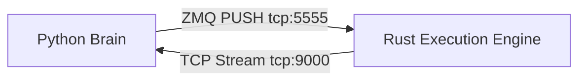

# ZMQ & Telemetry IPC Messaging Rules (`bongus/ipc/` & `execution_engine/src/ipc.rs`)

This document defines the interface and communication protocol between the Python brain and the Rust execution engine.

## IPC Overview

The system uses a split-channel architecture over local TCP sockets:



## 1. Python → Rust (Alpha Instructions)

- **Socket Type**: ZeroMQ `PUSH` (Python connects, Rust binds).
- **Endpoint**: `tcp://127.0.0.1:5555`
- **Serialization**: msgpack.
- **Timeout**: Send timeout is strictly set to $500\text{ ms}$ (`setsockopt(zmq.SNDTIMEO, 500)`).

### Instruction Schema (`AlphaInstruction`)

```rust
pub struct AlphaInstruction {
    pub symbol: Option<String>,
    pub intent: String, // e.g. "ENTER_LONG", "EXIT_LONG", "HEARTBEAT", "RESTORE_POSITION"
    pub quantity: f64,
    pub urgency: f64, // e.g. 0.4 for ENTER, 0.8 for EXIT
    pub max_slippage_bps: f64,
    pub exposure_scale: f64,
    pub heartbeat_id: Option<String>,
    pub intent_id: Option<String>,
    pub direction: Option<String>,
    pub skip_spot_leg: bool,
    pub skip_perp_leg: bool,
    pub spot_entry_price: Option<f64>,
    pub perp_entry_price: Option<f64>,
    pub spot_mark_price: Option<f64>,
    pub perp_mark_price: Option<f64>,
    pub spot_quantity: Option<f64>,
    pub perp_quantity: Option<f64>,
}
```

## 2. Rust → Python (Telemetry Events)

- **Socket Type**: Raw TCP socket (Rust binds to `127.0.0.1:9000`, Python connects).
- **Serialization**: msgpack streams unpacked using `msgpack.Unpacker`.
- **Note**: The legacy docstrings reference "JSON-line" format, but the live runtime uses msgpack binary streams for latency and footprint optimization.

### Event Variants

#### L2 Depth Event (`L2Depth`)
Sent by Rust Ws handlers to feed Python depth trackers.
```json
{
  "event": "L2Depth",
  "symbol": "BTCUSDT",
  "market": "spot" | "perp",
  "bids": [[price, qty], ...],
  "asks": [[price, qty], ...]
}
```

#### Heartbeat Acknowledgment (`HeartbeatAck`)
Sent immediately by Rust in response to a Python heartbeat command.
```json
{
  "event": "HeartbeatAck",
  "heartbeat_id": "uuid-string",
  "status": "ok",
  "ts_ms": 1716634076000
}
```

#### Order Execution Events (`OrderUpdate` & `OrderRejected`)
```json
{
  "event": "OrderUpdate",
  "symbol": "BTCUSDT",
  "status": "FILLED" | "PARTIALLY_FILLED" | "CANCELED" | "REJECTED",
  "client_order_id": "cid-string",
  "avg_fill_price": null | float,
  "last_fill_price": null | float,
  "cumulative_quote_qty": null | float,
  "commission": null | float,
  "commission_asset": null | string,
  "realized_pnl": null | float,
  "maker": boolean,
  "execution_type": string,
  "event_time_ms": integer,
  "spot_fill_price": float,
  "perp_fill_price": float
}
```

## 3. Connection Fail-Safes & Heartbeats

- **Frequency**: Python sends a `HEARTBEAT` intent every 2 seconds.
- **Python Heartbeat Staleness**: If no telemetry event is received in 45 seconds (`max_runtime_staleness_seconds`), Python sets `telemetry_connected` to False and triggers alert states.
- **Rust Heartbeat Staleness**: If no heartbeat intent is received in 12 minutes, Rust circuit breakers trip, halting all further maker execution.
