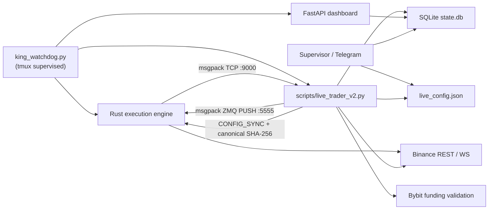

## Bongus Trading Bot: How It Works

### Canonical Runtime

The live system now has one production Python path:

1. `bongus/monitoring/king_watchdog.py` validates
   `bongus/runtime/process_manifest.json` and starts the Rust engine, canonical
   trader, sentiment scraper, and dashboard from that machine-readable source.
2. `scripts/live_trader_v2.py` is the current supervised production trader. `bongus/runtime/live_trader.py` remains a package-backed runtime path, but it is not what the watchdog starts today.
3. `LiveTraderV2` hot-loads runtime config, verifies state/IPC/account readiness, consumes Rust telemetry, scans the Binance universe, applies the governed active selector, and writes both active and shadow decisions into `state.db`.

### Python / Rust Split

- Python:
  - scanner, governed active ranking, and shadow LCB/portfolio construction
  - cost/risk/governance logic
  - settlement forecasts, shadow rotation/exit/plugins, and research features
  - state persistence and dashboard APIs
  - canonical config snapshots and authoritative exchange-statement ingestion
- Rust:
  - Binance WebSocket and REST connectivity
  - durable intent journal, order placement, and cumulative per-leg chase state
  - legging defense and maker/taker execution handling
  - broadcast of order-book and order-update telemetry back to Python
  - fail-closed config consensus and prospective compiled risk ceilings

### Live Cycle

Each trader cycle does the following:

1. Refreshes the tradable USDT-perp universe and keeps only names with a valid Binance spot hedge path.
2. Pulls funding and mark/index snapshots from Binance REST.
3. Merges those with Rust-fed book/depth telemetry.
4. Applies hard safety filters:
   - missing spot pair
   - low depth
   - wide spread
   - new listing
   - stale data
   - delist risk
   - structural toxicity
5. Persists every accept/reject decision into `candidate_snapshots`.
6. Runs the governed legacy ranking and, separately, records a settlement-aware
   lower-confidence-bound net-EV decomposition with:
   - predicted net funding edge after shared costs
   - depth
   - spread
   - short-horizon realized volatility
   - basis stability
   - regime health
7. Persists the ranked results into `opportunity_scores`.
8. Preserves active static allocation limits while a shadow optimizer evaluates:
   - per-symbol caps
   - factor, liquidity, venue, and settlement-cluster caps
   - gross exposure budget
   - reservations, executable capacity, CVaR, stress, and uncertainty shrinkage
9. Sends exit intents before any replacement entry.
10. Requires a matching Python/Rust effective-config hash for non-paper entry.
11. Journals futures income and margin interest before reconciling balances.
12. Writes market samples, health samples, pending intents, and risk state updates.

### Shared State Contract

`bongus/engine/state_store.py` is the runtime contract between trader, dashboard, supervisor, Telegram, and governance.

Core tables:

- `positions`
- `trade_history`
- `portfolio_stats`
- `risk_state`

Scanner / ranking / execution / governance tables:

- `candidate_snapshots`
- `opportunity_scores`
- `market_samples`
- `execution_events`
- `economic_ledger_events`
- `exchange_statement_entries`
- `exchange_statement_cursors`
- `execution_command_sequences`
- `execution_command_outbox`
- `lifecycle_events`
- `execution_quality`
- `pending_intents`
- `feature_snapshots`
- `model_shadow_decisions`
- `validation_snapshots`
- `parameter_promotions`
- `health_samples`

Schema creation is additive and idempotent so existing live databases can be reopened safely.

Important risk-state fields:

- `safe_mode_reason`: legacy comma-separated reason string.
- `safe_mode_codes`: structured descriptors from `bongus/engine/safe_mode.py` with `code`, `scope`, `recoverable`, and `next_action`.
- `entry_block_reason`: the current reason new entries are blocked, even when exits and recovery may still be allowed.
- `pause_new_entries`: operator/config pause for new entries only; recovery exits and flatten flows should be considered separately by callers.
- `liquidation_buffer_usd` and `minimum_liquidation_buffer_usd`: a fresh
  exchange available-margin observation below the protected floor is a
  kill-switch condition, not spare entry capacity.
- `config_hash_consensus`: true only when Rust has applied the exact current
  canonical config snapshot; it starts false after every Rust restart.
- `private_stream_recovery_ready`: true only after both spot and futures
  private streams replay bot-owned trades/orders through bounded,
  append-only cursors. Any gap or truncated page revokes it.
- `rust_execution_ready`: true only after Rust has reconciled spot and futures
  open orders, both account snapshots, durable internal orders, and bot-owned
  orphans after private replay.
- `telemetry_gap_detected`: records broadcast receiver overflow. A gap revokes
  both private-stream quorum and Rust readiness, reconnects the lagging client,
  and drives both private streams through cursor replay before it can clear.
- Rust refreshes paired spot/perpetual exchange filters outside the order actor.
  Entries require a fresh snapshot, while active-cycle filter or status changes
  preserve execution state and force reconciliation.
- `exchange_statement_ingestion_ready`: false when history fetches fail, rows
  are malformed, or an income type has no explicit accounting treatment.

### Cost And Risk

- `bongus/engine/cost_model.py` is the shared source of truth for fees, slippage, spread crossing, edge estimates, and payback calculations.
- Funding forecasts and realized funding are separate. The settlement lifecycle
  uses the exact exchange calendar, requires a filled position before the
  settlement instant, ignores later rate information, and credits no realized
  cash until a stable exchange statement ID supplies the actual amount.
- Each exchange fill can mature into an idempotent 60-second markout. Sparse
  route/symbol/regime estimates remain measurement-only and cannot relax a gate.
- The route optimizer compares passive, staged, simultaneous, sliced, and
  emergency policies in shadow. Actual commands remain `legacy_dual_maker`;
  any unpromoted route fails closed in Python and Rust.
- Every live/testnet spot or futures submission uses read-before-retry: an
  ambiguous POST is queried by deterministic client order ID twice, and only
  two authoritative not-found responses permit one same-ID retry.
- The order actor pumps authoritative private fills and urgent legging timers
  while signed REST calls are in flight. Submission state distinguishes a
  command that has not started (`PENDING_SUBMIT`), one whose REST request is in
  flight (`SUBMITTING`), and a stale plan suppressed after private progress
  (`NOT_SUBMITTED`).
- `bongus/engine/risk_engine.py` still owns hard limits, derisking, and kill-switch decisions.
- New risk is blocked when runtime telemetry is stale or safety thresholds are breached.
- The central reservation ledger treats spot cash, symbol-scoped borrowability,
  futures margin, fees, gross exposure, liquidation buffer, and repair/exit
  reserves as separate dimensions. It never substitutes equity for an unknown
  spot-borrow limit.

### Governance

`scripts/walk_forward.py` no longer stops at a research summary.

It now:

- evaluates walk-forward windows
- computes acceptance, utilization, and drawdown gates
- writes `validation_snapshots`
- writes `parameter_promotions`
- records a proposal that requires operator approval and does not mutate
  `live_config.json`

The experiment registry additionally requires immutable preregistration,
deterministic cohorts, sample-ratio checks, sequential alpha spending,
multiple-testing correction, guardrails, and an authorized promotion scope.

### Shadow Exits

The runtime records feature snapshots for open trades and writes shadow-mode hold-vs-exit recommendations into `model_shadow_decisions`.

Important:

- the shadow model is advisory only
- live exits remain deterministic
- ratcheting remains disabled until shadow uplift is proven

Settlement-aware ranking, incremental rotation, portfolio optimization,
strategy plugins, and read-only multi-venue comparisons follow the same
shadow-first boundary.

### Runtime Map

### Dashboard

`bongus/monitoring/web_dashboard.py` serves the legacy UI plus API endpoints for:

- positions, stats, trades, risk, and pnl attribution
- latest candidate snapshots
- opportunity scores
- execution-quality samples
- exact economic-ledger events/projections and a reconciled daily report
- shadow decisions
- validation snapshots and promotions
- health samples

HTTP and WebSocket routes share HTTP Basic viewer authentication and deny by
default when credentials are incomplete. Admin credentials are required for
mutating operator actions. The supervised bind is loopback-only by default.

That makes every cycle explainable: which names were scanned, why they were rejected, what ranked highest, and what the shadow exit model would have preferred.
