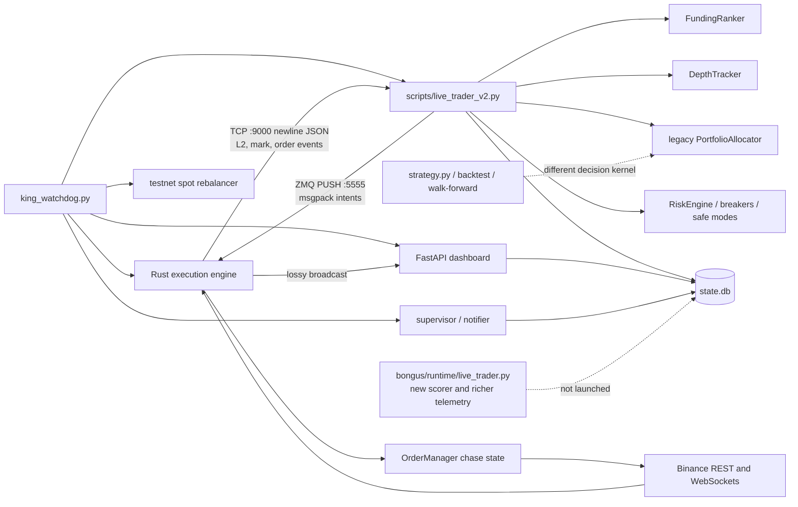
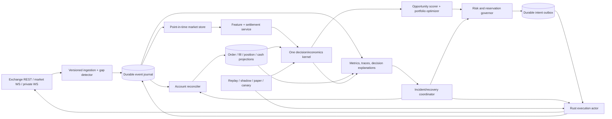

# Bongus autonomy and profit master plan

> Implementation tracking: the local Phase 0–6 code spine, activation boundary,
> verification commands, and still-blocked empirical gates are recorded in
> [`MASTERPLAN_IMPLEMENTATION.md`](MASTERPLAN_IMPLEMENTATION.md). Code presence
> does not authorize route/model/capital promotion.

**Audit date:** 2026-07-18  
**Repository snapshot:** `main` at `e3d5dd3`  
**Scope:** Python strategy/runtime, Rust execution engine, IPC, configuration, tests, documentation, logs, SQLite state and archives, supplied market data, research scripts, dashboard, and process supervision.  
**Change policy:** The audit and evidence collection were read-only. After the findings were assembled, the user explicitly authorized direct implementation and testing of the full plan. The later implementation pass is tracked separately in `MASTERPLAN_IMPLEMENTATION.md`; protected capital limits were never raised, and unsafe static fallbacks were lowered to match the paused $2,500-per-symbol/$10,000-gross live envelope.

> **Capital decision:** Do not increase capital yet. The system cannot currently produce a complete, idempotent and exchange-reconciled account of fills, fees, funding, borrow, basis PnL and hedge exposure. Improving selection or leverage before fixing that foundation would optimize an untrustworthy objective.

## Evidence and interpretation

The audit distinguishes three confidence classes:

- **High confidence / proven:** directly reproduced, present in active code, or visible in current persisted runtime evidence.
- **Medium confidence / strongly suspected:** code path is active and the failure mechanism is clear, but the repository lacks enough production samples to measure frequency or dollar effect.
- **Low confidence / hypothesis:** economically plausible and worth measuring, but not demonstrated by the available data.

The strongest empirical evidence is:

| Evidence | Result | Interpretation |
|---|---:|---|
| Current `state.db` | Integrity check passed; 44,352 candidate snapshots, 10 execution events, 0 closed trades, 0 opportunity scores, 0 feature snapshots, 0 shadow decisions, 0 execution-quality samples | Storage is readable, but the active runtime does not generate enough decision or outcome data to validate profitability. |
| Candidate history | 693 cycles over only about 16 minutes; 128 accepted and 44,224 rejected | This is a short operational episode, not a representative trading sample. Most rejections were missing basis or zero depth. |
| Validation snapshots | 5, all `INSUFFICIENT_DATA`/`ADJUST`; maximum 0.0153 days and zero closed trades | No validation gate has evidence for promotion. Current live overrides have weakened several targets, but still do not create evidence. |
| Archived/reset state | 27 approximately one-second trades; funding, basis, execution and borrow attribution are all zero | Historical rows cannot establish strategy expectancy. Some non-zero net PnL is unexplained by the recorded components. |
| Real-data backtest invocation | 2023-01-01 through 2024-12-31; 110 reported trades, 7 winners, 103 losers, reported net PnL -$1,001.16 on $5,000/trade; 0/100 walk-forward windows passed | It exposes fee-dominated churn. The exact return is **not reliable** because the replay contains look-ahead, timing, stop and unit errors documented below. |
| Available research data | One BTC-like spot/perpetual/funding series; no symbol field, cross-section, order book, spread, open interest or exchange event data | It cannot validate an eight-symbol allocator, capacity, fill policy, or funding predictor. |
| Python tests | Audit environment initially produced 351 passes, 3 async-environment failures and 2 skips; after dependency declarations/install, a data-quality regression test and the implementation pass, the full suite produced 364 passes and 2 skips | Broad unit coverage exists. Four warnings remain in existing async mocks, and several passing tests still encode flawed replay semantics. |
| Test collection/dependencies | Initially failed because `httpx` and `joblib` were missing; `scikit-learn` was imported but undeclared/uninstalled and `pytest-asyncio` was declared but absent from the venv | Dependency declarations were completed and the full suite now collects/runs. A fully locked clean-room build is still Phase 0 work. |
| Scoped type check | Initially 3 active-scope errors; after the implementation pass, `pyright bongus scripts/live_trader_v2.py` reports 0 errors | The full configuration still scans stale worktrees/tests and needs scope cleanup, but active production Python is type-clean under the current configuration. |
| Rust tests | 18/18 passed | Useful baseline, but the state-machine failure modes below are not represented. Compiler warnings show top-of-book quantities and ranking structures are unused. |
| Current log | Repeated cross-validation warnings, exit-confirmation timeouts, a 499,722,570 bps volatility input, insufficient spot balance, dashboard port collision, and a trader-loop restart on the audit date | The present supervisor/runtime cannot be considered autonomously healthy. |

Sensitive `.env` values were not reproduced. Only configuration inconsistencies relevant to risk were compared.

### Immediate implementation pass

Four focused remediation groups were implemented after the audit snapshot:

| Remediation | Implemented behaviour | Verification at integration time | Remaining scope |
|---|---|---|---|
| Testnet dust sweeper boundary (D-05) | Permanently retired; direct invocation fails closed, the legacy flag is diagnostic only, and the watchdog can never launch it. Reconciliation-bound treasury remains proposal-only. | Integrated reservation/external-order treasury coverage, watchdog/entry-point tests, scoped Pyright and compilation passed | Any future transfer adapter still requires separate approval, account isolation, reconciliation leases, and empirical gates. |
| Fill-cost persistence/accounting mitigation (D-01) | `PARTIALLY_FILLED`/`FILLED` events are committed before lifecycle mutation; a persistence failure defers mutation; cost query includes commission-bearing partial and final `TRADE` events while excluding lifecycle summaries | 23 state-store and 115 startup/lifecycle tests passed | Full exchange-ID idempotency, atomic lifecycle transactions and a complete funding/borrow/cash ledger remain P0 work. |
| Rust fail-closed intent and exit hardening (D-13) | Unknown/malformed intents emit `unsupported_intent` before side effects; futures limit exits carry `reduceOnly=true`, while entries do not | 21 Rust tests passed; touched-file formatting and Clippy completed with existing warnings only | Durable protocol ACK/idempotency and post-exit exchange reconciliation remain P0 work. |
| Reproducible local test/type baseline (D-24) | Declared direct `numpy`, dashboard `httpx`, and ML `joblib`/`scikit-learn` dependencies; installed missing declared test plugin; narrowed the Polars numeric scalar type and added a regression | Full Python suite passes; active production Pyright is clean; `pip check` reports no broken requirements | Exact dependency locking, stale-worktree exclusion and four existing async-mock warnings remain. |

These fixes reduce immediate tail risk but do **not** change the capital decision or establish profitability.

---

## A. Executive summary

### Current maturity

Bongus is an **early validation prototype with several production-shaped components**, not a production-ready autonomous trading system. The architecture has good ingredients—separation of Python decisions from Rust execution, SQLite state, preflight checks, safe modes, an exit-first rotation intention, and a meaningful test suite—but those ingredients are not joined by a single trustworthy economic and state model.

The bot is currently configured with `pause_new_entries=true`. That is appropriate. There is no credible evidence in the repository that the current strategy is net profitable after all costs, and there are several paths that can produce untracked or incorrectly classified exposure.

### The most important problems

1. **Measurement is not decision-grade.** Partial-fill fees are omitted from one cost query, execution-event persistence races finalization, funding and fill prices may be synthesized, and the current database has no closed trades or execution-quality samples. A strategy cannot be profit-optimized without a reconciled ledger.
2. **Execution state is not transactionally safe.** The Rust state machine lacks durable intent idempotency, cumulative per-leg fill accounting, explicit cancel-pending/ambiguous states and replayable acknowledgements. Partial-fill/cancel races, disconnects and lossy telemetry can create over-hedges, orphaned orders or false “flat” conclusions.
3. **The active selector is not the designed selector.** Production uses headline signed funding and the legacy allocator. The multi-factor scorer, opportunity-score persistence and cleaner package runtime are dormant.
4. **Funding economics are modeled incorrectly.** A discrete settlement payment is prorated continuously to the next settlement while a full round trip is charged. Per-symbol settlement intervals are hard-coded to eight hours even though Binance exposes adjusted `fundingIntervalHours` for some symbols.
5. **Research cannot validate production.** Replay does not share the production decision kernel; it has same-bar funding credit, integer time overflow, basis-stop and unit errors. Walk-forward does not train/test the live decision process. Available data is insufficient for multi-symbol or execution research.
6. **Autonomy often means restart rather than recovery.** Logs show stale-loop restarts and a dashboard port collision that becomes fatal. The liveness heartbeat can remain fresh while the trading loop is stuck, safe-mode recovery contains contradictory or unreachable paths, and state changes are not an atomic unit of work.

### Largest likely profit leaks

Ranked by expected importance, while acknowledging that exact dollars cannot be estimated yet:

1. **False economic decisions from incomplete costs and settlement timing**—both missed valid settlements and entries whose gross rate does not survive costs.
2. **Execution and hedge-repair failures**—taker conversions, adverse selection, excess quantity, lingering exposure and emergency unwinds can dominate a funding edge measured in basis points.
3. **Fee-dominated churn and economically invalid rotations**—the explicit replay paid 26.4% in aggregate fee percentage versus 5.07% gross yield under its own flawed accounting.
4. **Idle capital caused by global/sticky/stale blockers**—a single symbol or feed can freeze unrelated opportunities, while current telemetry cannot quantify block duration.
5. **Selection by headline funding instead of lower-confidence-bound net EV**—liquidity, persistence, capacity, prediction uncertainty and portfolio concentration are not part of the active ordering.

### Highest-value improvements

The highest-return sequence is foundational:

1. Build a durable, idempotent economic ledger and exchange reconciliation invariant.
2. Replace the execution protocol/state machine with explicit per-leg cumulative states and residual hedging.
3. Make replay, shadow and live trading call one versioned decision/economics kernel.
4. Implement settlement-calendar net EV and incremental-EV rotation with measured per-leg execution costs.
5. Collect decision, fill and outcome evidence in shadow/paper/canary modes before changing capital.

Profit cannot be guaranteed. The realistic objective is to demonstrate a statistically credible, net-of-all-costs edge with bounded operational loss before exposing more capital.

---

## B. Architecture map

### Active runtime



### Decision ownership

| Decision | Active owner | Notes |
|---|---|---|
| Process launch/restart | `bongus/monitoring/king_watchdog.py` | Launches Rust, V2 Python trader, dashboard, supervisor and testnet rebalancer. |
| Funding snapshot/ranking | `FundingRanker` plus `scripts/live_trader_v2.py` | REST polling and mark-event updates feed a headline signed-rate list; freshness is global. |
| Liquidity gate | `DepthTracker` and `PortfolioAllocator` | Uses depth relative to notional; active stored history shows many zero-depth rejections. |
| Candidate selection | Legacy `PortfolioAllocator.decide()` | The richer `rank_candidates()` path and opportunity-score table are not used by the launched trader. |
| Entry/exit economics | V2 helper methods plus `CostModel` | Costs are estimated, but discrete settlement timing, spread attribution, borrow and actual execution calibration are incomplete. |
| Position sizing | V2 plus allocator/config | Multiple notional meanings and reservation calculations coexist. |
| Portfolio risk | `RiskEngine`, safe modes, correlation breaker, V2 preflight/validation policies | Several controls overlap or use different thresholds/scopes. |
| Order routing | Rust `OrderManager` | Maker-first chase with legging defense; urgency and several execution parameters are not actually honored. |
| Exchange reconciliation | Rust startup/audit plus Python startup recovery | Neither layer owns a complete, durable two-leg truth model. |
| Persistence | Python `StateWriter`/`StateReader` on SQLite | Many separate commits; no atomic trade lifecycle transaction or idempotent event key. |
| Reporting | Dashboard, logs, validation snapshots | The schema anticipates richer metrics, but the active V2 runtime does not populate key tables. |

### Important implementation drift

- `bongus/runtime/live_trader.py` records opportunity scores, feature snapshots, shadow decisions and execution quality, but the watchdog launches the 8,000-line `scripts/live_trader_v2.py` instead.
- A second large root `live_trader_v2.py` differs from the launched script. Root-level compatibility wrappers and stale worktrees add further ambiguity.
- The historical `strategy.py`/backtest and the live V2 strategy do not share a decision kernel, so passing research does not imply live equivalence.
- Rust also contains dormant ranking/strategy structures, but its autonomous strategy is disabled; Python is intended to be the sole alpha authority.

---

## C. Current strategy reconstruction

### What the bot actually does

1. **Startup and preflight.** The watchdog starts the components. V2 initializes SQLite, cancels/restores state depending on mode, connects to the Rust telemetry socket, and establishes risk/preflight flags. In paper mode it clears positions and execution events, so restart continuity is intentionally lost.
2. **Market observation.** The Rust engine subscribes to depth and mark streams. It broadcasts newline-delimited JSON over TCP. V2 updates depth/funding caches synchronously in the telemetry read loop. REST funding refresh runs roughly every 60 seconds; the trading loop sleeps a hard-coded one second.
3. **Discovery.** `FundingRanker.get_ranked()` sorts monitored symbols by the signed displayed rate. The code supports both long-spot/short-perpetual and inverse direction, but the current live configuration disables autonomous inverse entries.
4. **Filtering.** V2 applies preflight, operator pause, validation, risk-engine, safe-mode, hedge-gap, data-freshness, cooldown, position-count, depth, spread/basis, capacity and expected-edge gates. Several are global even where a symbol-local response is intended.
5. **Allocation.** The active legacy allocator considers the ranked list and available slots. Entry largely depends on annualized headline funding and depth. Only the leading replacement is considered for rotation.
6. **Economics.** Funding is annualized as raw rate × 1,095. V2 estimates round-trip spot/perpetual fees, spread and slippage, then compares a prorated funding value to costs plus reserves. The same combined spread can be applied to both legs, and a slippage reserve is added after slippage is already in the cost model.
7. **Sizing.** The live override currently uses $2,500 notions while static documentation/config retain other slot/gross semantics. Pending reservations count quantity × price once and then compare it with pair gross, making capacity accounting inconsistent.
8. **Execution.** Python sends an unacknowledged msgpack intent through a non-blocking ZMQ PUSH socket. Rust normally places dual maker orders. A full first-leg fill triggers cancellation of the other maker and a taker hedge. Partial fills do not cause a state transition to a quantified residual-hedge state.
9. **Monitoring.** Mark/funding/depth/order events update in-memory and SQLite state. Some expected costs exist only in memory. Funding income can be synthesized from the entry rate if REST history is absent, and missing fills may be replaced with marks or entry prices.
10. **Rotation.** V2 enforces exit-first at the Python decision layer and waits for a `FILLED` confirmation or timeout. The allocator triggers on a raw annualized funding gap, not configured payback or incremental net value. Logs contain exit-confirmation timeout and deferred-entry examples.
11. **Exit.** Economic thresholds, risk de-risking, breaker states and emergency conditions can initiate exits. If `allow_new_risk` is false without an explicit de-risk/kill decision, the main loop skips before normal economic exit evaluation.
12. **Recovery.** The watchdog restarts stale/crashed processes. Rust reconciliation fetches selected orders/balances and may cancel or purge state. Safe-mode flags and Python recovery code attempt to resume, but the live startup policy rejects the autonomous-recovery flag that the unpause path requires.

### Reconstructed entry economics

For the implemented model, an approximate candidate value is:

```text
expected funding until next settlement
  = abs(displayed raw funding) × fraction of an assumed 8-hour interval remaining

estimated net edge
  = expected funding
  - round-trip spot fee
  - round-trip perpetual fee
  - modeled bid/ask and slippage on both legs
  - extra edge/slippage reserves
```

That is not the correct cash-flow model. If a position is eligible at the settlement instant, it receives the discrete funding payment; it does not receive a time-proportional fraction merely for holding part of the interval. Conversely, being open shortly before settlement carries high reversal, basis and execution risk. The right model is a probability distribution over settlement payments conditional on surviving through each event.

Using the current live settings as the code interprets them—$2,500 pair gross, $1,250 per leg, $150,000 depth and a representative 4 bps combined spread—the model estimates about **33.73 bps** round-trip cost before a 20 bps reserve. It then requires approximately:

| Time before assumed settlement | Raw displayed funding needed by the current prorated gate |
|---:|---:|
| 8 hours | 0.537% |
| 4 hours | 1.075% |
| 1 hour | 4.30% |

These values are diagnostic, not calibrated market truth. They show why a continuously prorated payment plus a full round trip creates strong time-dependent false rejection. The static 15% annualized entry threshold by itself is only about 1.37 bps per eight-hour settlement, far below estimated round-trip friction.

Binance exposes a funding-rate-info endpoint for symbols whose caps, floors or interval were adjusted, including `fundingIntervalHours`; the active code instead hard-codes 00:00/08:00/16:00 UTC. See the official [Binance funding-rate information schema](https://developers.binance.com/en/docs/catalog/core-trading-derivatives-trading-usd-s-m-futures/api/rest-api/market-data#get-funding-rate-info).

### Economic coverage matrix

| Economic component | Current coverage | Assessment |
|---|---|---|
| Funding amount and timing | Displayed/predicted rate; assumed eight-hour clock; synthetic fallback | **Incorrect/incomplete.** No settlement ledger or per-symbol interval calendar. |
| Spot and perpetual fees | Static maker/taker assumptions and event commissions | **Partial.** Actual partial-fill commissions are omitted by a final-only query; fee tier/discount changes are not reconciled. |
| Maker versus taker | Cost-model probability; live non-paper path sets maker probability to zero | **Uncalibrated.** This conservatively overblocks while Rust still attempts maker-first routing. |
| Bid/ask spread | Combined spread passed into cost model | **Misapplied.** The combined value can be charged to each leg; per-venue executable prices are needed. |
| Slippage/impact | Depth-scaled approximation plus an additional guard | **Partial/double-reserved.** Top-of-book quantities are unused in Rust and no realized shortfall calibration exists. |
| Partial fills | Events and simple quantity accumulation | **Unsafe.** Protocol lacks explicit cumulative semantics/version, residual state and idempotent fill keys. |
| Legging risk | Timeout/defense paths | **Not priced or bounded correctly.** No unhedged notional-time objective; full original quantity can be hedged after partial activity. |
| Basis movement | Entry/exit basis, stop helpers | **Inconsistent.** Historical stop uses absolute movement and can exit favorable convergence; live attribution can be synthetic. |
| Borrow/financing | Fixed 10% annual fallback in live close attribution | **Not trade-specific.** It is absent from entry EV and does not reflect actual liability/interest. |
| Idle-capital opportunity cost | Not in active scoring | **Missing.** Global blockers and reservations cannot be evaluated economically. |
| Margin/capital lock | Gross caps and slot limits | **Incomplete.** Python/Rust gross definitions and equity limits differ; no marginal margin or liquidation-distance charge. |
| Entry/exit costs | Full round-trip model | **Partial.** Does not condition on likely exit urgency, residual size or venue-specific execution. |
| Rotation costs | Raw rate gap only | **Missing from active decision.** Configured payback/incremental-edge knobs are unused. |
| Failed/cancelled orders | Logged/state events | **Not attributed.** No-opportunity-cost, cancel latency or orphan repair cost in trade PnL. |
| Adverse selection | Some toxicity/volatility ideas | **Not measured.** No post-fill markout by route. |
| Funding decay/reversal | In-memory simple predictor | **Weak.** Untimestamped, restart-lost, cadence-weighted and not calibrated. |
| Precision/exchange constraints | Exchange info plus fallbacks | **Incomplete.** Guessed filters on failure; misses several lot/market/status/percent constraints and uses binary floating point. |
| Liquidation/margin buffer | Leverage/gross/risk controls | **Not exchange-reconciled.** No portfolio liquidation-distance or margin-tier model in opportunity EV. |

### Risk-control map

This groups every material active control family; individual reason codes should ultimately map to this taxonomy.

| Control | Trigger | Action today | Automatic recovery / stuck risk | Assessment |
|---|---|---|---|---|
| Operator `pause_new_entries` | Live config flag; currently true | Global entry block | Supervisor may write false, but startup/autonomy policies conflict; config reload is sticky | Correct as an operator control; must never be cleared without explicit ownership and audit. |
| Startup/preflight gate | IPC, credentials/mode, reconciliation and safety checks | Blocks runtime or new risk | Some failures lead to restart; historical `blocked_execution_bridge` remained | Safety-positive, but needs deterministic recovery state and readiness quorum. |
| Validation gate | Minimum duration/trades/Sharpe/model error/uptime/win rate | Blocks or scales new risk | Can auto-adjust weak config; present snapshots all insufficient | The current live targets (1 day, 10% uptime, Sharpe 0.1) are not adequate capital-promotion evidence. |
| `RiskEngine` drawdown/exposure | Drawdown, loss streak, gross exposure, health | Half size, de-risk, kill/flatten | State persisted partly; high-water logic has live overrides | Necessary, but unit/equity truth must be unified and economic exits must still run during entry blocks. |
| Safe-mode flags | Data/execution/health anomalies | Symbol or global block/recovery handling | Flag catalog omits actual runtime reasons; unknown flags can require operator review | Good concept; ownership, scope and exit criteria are inconsistent. |
| Hedge-gap policy | Local/exchange mismatch | Described as symbol-local but global entry guard checks any gap | Can remain globally blocking | Must isolate the affected symbol and reserve only repair capital unless systemic truth is uncertain. |
| Funding/data freshness | REST/WS age and availability | Candidate rejection or fail-open in predictor path | One update refreshes the global clock | Must be per symbol/source/field and fail closed for that symbol. |
| Depth/spread/basis gates | Insufficient depth, wide spread, missing basis | Candidate rejection | Recovers on the next sample | Appropriate shape; thresholds need per-symbol calibration and reason-duration metrics. |
| Cooldowns | Recent exit/failure/recovery | Symbol entry block | Mostly in-memory; lost on restart | Persist monotonic expiry/reason and distinguish economic from operational cooldowns. |
| Correlation breaker | Fraction of positions below a static funding exit threshold | HALT, partial exit or emergency exit | Thirty-minute escalation timer is in-memory | It does not measure correlation, uses static rather than live exit threshold, and may exit the most liquid positions first. Rename/redesign. |
| Execution caps/toxicity | Gross cap, volatility, basis/toxicity inputs | Reject/shorten patience/defense | Several inputs are stale or invalid; one log showed 499m bps volatility | Safety intent is correct; projected exposure and fresh executable depth must replace current checks. |
| Rust system state | Disconnected, Reconciling, Trading | Blocks/permits intent handling | A single connection event can enter Trading before all required feeds are ready | Needs readiness quorum, explicit degraded state and reconciliation generation. |
| Watchdog liveness/crash tracker | Process exit, RAM, stale trader loop, port conflict | Restart; eventually permanent failure | In-memory crash counter; port collision repeatedly fatal | Recovery is too coarse and can misclassify a stuck trading loop as healthy. |

Target severity semantics should be: **informational**, **size reduction**, **symbol block**, **temporary global entry block**, **controlled unwind**, **emergency flatten**, and **shutdown/human review**. A control must declare its scope, owner, evidence, expiry/recovery predicate and whether exits remain allowed.

---

## D. Findings

### D-01 — The economic ledger cannot prove realized net PnL

**Post-audit status:** Partially mitigated. Fill events now persist before finalization and the cost query includes partial-fill commissions, but the broader ledger/idempotency/atomicity finding remains open.

- **Severity:** Critical
- **Confidence:** High
- **Relevant files/functions:** `bongus/engine/state_store.py::record_execution_event`, `StateReader.estimate_trade_execution_cost` (around 935-979 and 1845-1875); `scripts/live_trader_v2.py::_run_execution_event_writer`, `_finalize_entry_fill`, `_finalize_exit_fill` (around 3282-3304, 5004, 6320-6640).
- **Evidence:** `estimate_trade_execution_cost` filters `status='FILLED'`. In the retained ATA execution sequence, all fill-event commissions total about $2.4892 while terminal-`FILLED` commissions total about $1.7683, omitting 28.96%. For one completed entry/exit pair the difference is about 48.41%; for the first entry alone it is 72.74%. Finalization queries SQLite immediately after queueing the terminal event to a separate async writer, so even the terminal cost may not yet exist. The current database has zero closed trades and zero execution-quality samples.
- **Current behaviour:** The runtime mixes exchange event data, in-memory estimates and fallbacks. Funding can be synthesized from entry funding; fill prices can fall back to marks; expected entry cost can be lost on restart. Execution events have no exchange trade ID, venue/leg/cycle identity or unique idempotency constraint.
- **Why it matters:** A few basis points determine whether funding arbitrage is viable. Missing commissions or synthetic cash flows can reverse the sign of measured edge and make every model, threshold and dashboard KPI misleading.
- **Estimated effect:** Unbounded measurement error; demonstrated commission undercount of 29-73% on the tiny retained sample. It can cause both false promotion and unnecessary blocking.
- **Recommended correction:** Create an append-only double-entry economic ledger keyed by account, venue, symbol, cycle, intent, order, exchange trade/fill and funding transaction IDs. Record raw exchange payload plus normalized version. Derive PnL from cash/balance/position deltas: funding, trading fees, spread/shortfall, basis, borrow, transfers and residual inventory. Persist the terminal event and lifecycle transition in one transaction or make finalization consume an acknowledged durable event stream. Never invent realized cash flows; label estimates separately.
- **Required tests:** Duplicate/reordered fill replay; partial plus terminal fills; writer crash between event and transition; commission in multiple assets; restart recovery; funding ledger reconciliation; property test that replay is idempotent; daily exchange statement/balance reconciliation to the smallest exchange unit.

### D-02 — Partial-fill and cancel races can over-hedge or leave a naked leg

- **Severity:** Critical
- **Confidence:** High for the state-machine gap; medium for live frequency
- **Relevant files/functions:** `execution_engine/src/order_manager.rs::ChasePhase`, `ChaseState`, order-update handling and legging defense (around 218-247 and 1201-1395).
- **Evidence:** Chase phases are only `Idle`, `DualMakerPlaced`, `LegFilledWaiting` and `LeggingDefense`. Partial fills update local quantities but do not enter an explicit residual-hedge state. On a full first-leg fill the engine cancels the other maker and submits a taker hedge for the original quantity without first proving the cancel outcome and cumulative fill total.
- **Current behaviour:** A fill that races a cancel can be followed by a full-size hedge, producing excess exposure. Conversely, a partial first-leg fill can wait in a phase that does not encode how much is unhedged or what deadline applies. Historical payloads appear to use different quantity semantics than the current Rust parser (`l`, last-fill quantity), but the protocol has no schema/version field to make replay safe.
- **Why it matters:** Funding edge is small relative to the cost and directional risk of an accidental extra leg. This is a direct catastrophic-loss path during volatility or exchange latency.
- **Estimated effect:** Potentially larger than months of funding income in one incident; routine occurrences also increase taker fees and adverse selection.
- **Recommended correction:** Track exchange-cumulative filled quantity per venue/leg and compute `residual = target - confirmed_cumulative`. Add `PARTIALLY_FILLED`, `HEDGE_REQUIRED`, `CANCEL_PENDING`, `RECONCILE_AMBIGUOUS`, `HEDGED`, `COMPLETED` and `FAILED` states. Confirm cancel or query order truth before hedging; hedge only the residual. Use monotonic generation numbers and exact decimal quantities.
- **Required tests:** Every permutation of partial/fill/cancel/expire arrival; late fill after cancel acknowledgement; duplicate/out-of-order update; restart in each phase; randomized state-machine/property test that absolute hedge mismatch never exceeds the proven residual plus configured tolerance.

### D-03 — Intent delivery and telemetry are lossy and non-idempotent

- **Severity:** Critical
- **Confidence:** High
- **Relevant files/functions:** `bongus/ipc/execution.py::ExecutionClient.send`; `execution_engine/src/ipc.rs`; `execution_engine/src/main.rs` TCP broadcast (around 289-323); Rust alpha handling in `order_manager.rs`.
- **Evidence:** Python uses ZMQ PUSH with `NOBLOCK`, a 500 ms send timeout and zero linger. The intent ID is not an end-to-end idempotency key and there is no ACK, sequence, schema version, TTL or durable outbox/inbox. Rust events use a bounded broadcast channel; lagged consumers skip messages and TCP clients receive no sequence/gap/replay mechanism.
- **Current behaviour:** Python may not know whether an intent was accepted. A retry risks duplication; no retry risks loss. A slow callback or reconnect can miss order state. Raw order events are broadcast before state deduplication.
- **Why it matters:** Exactly-once exchange effects cannot be built on at-most-once intent delivery and lossy observations. Timeout cannot distinguish “not sent,” “accepted,” and “executed.”
- **Estimated effect:** Rare but potentially critical duplicate/missing trades; recurring unexplained timeout, stale pending state and idle capital.
- **Recommended correction:** Introduce a versioned command/event protocol with durable outbox/inbox, deterministic intent and client-order IDs, ACK states (`received`, `validated`, `submitted`, `terminal`), deadline/TTL, monotonic per-account sequence and replay cursor. Exchange actions remain at-least-once, but deterministic IDs plus read-before-retry make their economic effect exactly once.
- **Required tests:** Drop/duplicate/reorder every protocol frame; kill either process after each ACK boundary; reconnect with a sequence gap; backpressure beyond channel capacity; retry after unknown REST response; assert one effective exchange order per intent.

### D-04 — Reconciliation can declare trading-ready or flat without proving both legs

- **Severity:** Critical
- **Confidence:** High
- **Relevant files/functions:** `execution_engine/src/order_manager.rs` disconnect handling (around 1940-1957), periodic position audit (3050-3185), reconciliation (3188-3379); `execution_engine/src/main.rs` stream startup; `scripts/live_trader_v2.py` startup/recovery and position sync.
- **Evidence:** Disconnect handling clears chase states without cancelling or reconciling live orders. Reconciliation primarily maps futures orders/balances; internal orders do not carry venue identity. A filled dangling order may have its status changed without applying the fill. The periodic audit can remove a local symbol when futures quantity is zero even if a spot asset remains. Any market-data/user connection event can move the system toward `Trading` without a readiness quorum for both user streams and market data.
- **Current behaviour:** Rust has only `Disconnected → Reconciling → Trading`. There is no durable reconciliation epoch, degraded mode, two-leg invariant or explicit ambiguous state. Exit completion can remove the whole local position based on a paired terminal message even when dust/residual remains.
- **Why it matters:** “Flat” is a financial invariant, not a local status. An orphaned spot or perpetual leg is directional exposure and may be invisible to risk, PnL and shutdown logic.
- **Estimated effect:** Catastrophic tail exposure and chronic balance mismatch; also false entry blocks and manual repair.
- **Recommended correction:** Reconcile open orders, trades/fills, spot balances/liabilities, perpetual positions and funding/fee cash flows for both venues under one account-scoped epoch. Require all mandatory feeds and REST snapshots to agree before `READY`. Represent ambiguity explicitly, cancel only bot-owned orders, repair to the smallest safe residual and verify post-action exchange truth.
- **Required tests:** Disconnect with each order state; lost fill during downtime; spot-only/futures-only residue; exchange query timeout; one user stream unavailable; dust and minimum-notional cases; prove no `READY` transition without a complete two-leg snapshot.

### D-05 — The always-launched “rebalancer” can liquidate testnet hedge inventory

**Post-audit status:** The destructive execution path is now permanently retired. The legacy flag cannot authorize it, direct calls fail closed, the watchdog never launches it, and reservation-aware treasury consumes full reconciliation evidence but remains proposal-only.

- **Severity:** Critical for testnet validation; High operationally
- **Confidence:** High
- **Relevant files/functions:** `bongus/monitoring/king_watchdog.py::REBALANCER_COMMAND`, `_build_process_defs` (around 187 and 815-821); `bongus/portfolio/auto_rebalance.py::run_sweeper`, `market_sell` (48-111).
- **Evidence:** The watchdog always launches the rebalancer. It polls the Spot Testnet account every 60 seconds and market-sells full free non-USDT balances. That inventory is exactly the long spot hedge held by the strategy. Logs also contain insufficient spot-balance hedge failures, although the audit cannot prove this process caused each one.
- **Current behaviour:** A component named for capital rebalance acts as an account-wide dust/liquidation sweeper with no knowledge of bot positions, reservations, intent ownership or mode-level orchestration.
- **Why it matters:** It corrupts paper/testnet validation and can manufacture hedge gaps, failed exits and misleading strategy PnL. A validation environment that contains an adversarial internal process cannot establish safety.
- **Estimated effect:** Potential liquidation of 100% of a free spot hedge in testnet; invalidates affected experiments.
- **Recommended correction:** Remove it from default orchestration. Replace it with a reservation-aware treasury service that only moves explicitly unencumbered balances, uses bot/account scopes, produces proposed actions and requires a reconciliation lease. Dust sweeping should be a separate, disabled maintenance command.
- **Required tests:** Open hedge is never sellable; pending/repair reserves are protected; concurrent lifecycle transition; multiple strategies/accounts; testnet end-to-end run showing no unexplained balance delta.

### D-06 — Production bypasses the net-EV opportunity scorer

- **Severity:** High
- **Confidence:** High
- **Relevant files/functions:** `bongus/monitoring/king_watchdog.py` trader command; `scripts/live_trader_v2.py` allocator construction and ranking loop (around 317-322 and 7839-7904); `bongus/market_data/funding_ranker.py::get_ranked`, `rank_candidates` (161-312); `bongus/portfolio/portfolio_allocator.py::decide` (185-233); `bongus/runtime/live_trader.py` score persistence.
- **Evidence:** The launched V2 runtime calls `get_ranked()` and the legacy allocator. The richer scorer is not on that path. `state.db` contains 44,352 candidate snapshots but zero `opportunity_scores`, directly confirming the active path bypass.
- **Current behaviour:** Symbols are ordered primarily by signed headline funding, then filtered by thresholds/depth. Prediction confidence, full net cost, capacity, spread stability, risk contribution and existing-portfolio correlation do not jointly determine ranking.
- **Why it matters:** Highest displayed funding is often highest because the asset is crowded, volatile, hard to borrow, illiquid or about to mean-revert. Ranking must optimize realizable portfolio value, not nominal rate.
- **Estimated effect:** Strongly suspected major missed-edge and adverse-selection source; exact amount cannot be measured until shadow scores and outcomes are recorded.
- **Recommended correction:** Create one versioned `OpportunityEvaluation` kernel used by replay, shadow and live. Rank by a conservative lower confidence bound on expected net dollars per reserved dollar and risk-time. Persist every feature, model version, cost estimate, uncertainty term, rejection and selected alternative.
- **Required tests:** Golden parity across replay/shadow/live; monotonicity for cost/depth/confidence; deterministic ranking; missing-feature handling; counterfactual top-k outcome study; no live order unless its persisted evaluation version exists.

### D-07 — Funding cash flows are modeled as continuous and on a hard-coded calendar

- **Severity:** High
- **Confidence:** High
- **Relevant files/functions:** `scripts/live_trader_v2.py` time-to-funding and entry gate (around 7271-7368); `bongus/engine/cost_model.py` holding-period return (194-212); `bongus/market_data/funding_predictor.py`.
- **Evidence:** V2 computes time to the next 00:00/08:00/16:00 boundary and prorates displayed funding by remaining fraction. Positions can persist for multiple settlements, but entry EV only models the next prorated value. Binance exposes symbol-specific adjusted intervals, which are not fetched.
- **Current behaviour:** The closer an otherwise identical opportunity is to settlement, the less funding the model credits, even though settlement is discrete. It also does not model eligibility, payment sign/magnitude distribution, survival through multiple settlements, or funding caps/floors.
- **Why it matters:** The gate can reject the best time to capture a payment, accept decaying headline rates without sufficient persistence, and misprice expected holding duration.
- **Estimated effect:** Demonstrated threshold distortion from about 0.537% required raw funding eight hours out to 4.30% one hour out in a representative current-setting calculation.
- **Recommended correction:** Maintain a per-symbol settlement calendar and predict each prospective settlement. Compute `E[funding cash flow] = Σ P(open and eligible at settlement k) × E[rate_k | features] × liable_notional`, with uncertainty/downside penalties and conditional exit costs. Treat holding before settlement as risk exposure, not earned funding.
- **Required tests:** Non-eight-hour interval; interval/cap change; entry one second before/after settlement; multiple settlements; negative/inverse direction; missed eligibility; DST-independent UTC calendar; exchange funding transaction reconciliation.

### D-08 — Rotation is based on raw rate gap, not incremental expected net value

- **Severity:** High
- **Confidence:** High
- **Relevant files/functions:** `bongus/portfolio/portfolio_allocator.py` rotation branch (around 213-222); V2 exit-first pending-rotation handling; `bongus/core/config.py` and `live_config.json` rotation settings.
- **Evidence:** The active allocator compares annualized funding gap. `ROTATION_MAX_PAYBACK_DAYS`, minimum incremental edge and rotation payback helpers are not used in the active decision. With a 3 percentage-point annualized gap and representative friction, payback can be roughly 703 hours versus the intended eight-hour cap. Only the first ranked replacement is considered.
- **Current behaviour:** A switch can be triggered despite closing/opening friction, settlement timing, transition loss, uncertainty and residual value; or a superior lower-ranked candidate can be ignored. Rotation is all-or-nothing even where a partial rebalance is better.
- **Why it matters:** Churn consumes the small funding edge. Slow/failed exit confirmation also locks the slot and loses both old and new funding.
- **Estimated effect:** High suspected fee and opportunity-cost leak; explicit replay is fee dominated, but current live data cannot isolate rotation dollars.
- **Recommended correction:** Rotate only when `LCB(EV_new over horizon) - LCB(EV_keep) - close_cost - open_cost - transition_loss - risk_penalty > hysteresis`, payback is within a configured horizon, and confidence remains for multiple observations. Optimize partial rotation across all candidates subject to reservations and settlement calendar.
- **Required tests:** No rotation below incremental EV; hysteresis/hold/cooldown; near-settlement cases; partial rotation; failed/partial exit; candidate rank changes; counterfactual keep-versus-rotate attribution.

### D-09 — Backtest and walk-forward results are not decision-valid

- **Severity:** High
- **Confidence:** High
- **Relevant files/functions:** `bongus/strategies/strategy.py` timing, state and funding credit (44-62, 170-218, 227-276, 303-315); `bongus/engine/analytics.py` returns (47-85); `scripts/backtest.py`; `bongus/strategies/walk_forward.py` (77-116 and 202-210); strategy tests.
- **Evidence:** Polars hour/minute arithmetic overflows `Int8` after 02:07 (for example 02:08 becomes -128 minutes). A trade starts on the signal row and receives that row's funding. Entry prices based on shifted values can be null on the first row. The absolute basis stop also exits favorable convergence. Analytics mix one-leg funding with pair gross and summed percentage costs, approximately doubling dollar attribution. Walk-forward ignores its training data, counts selected minutes as trades, uses proxy targets rather than realized net trade outcomes and can write live config.
- **Current behaviour:** Research, live and walk-forward implement different lifecycle/economic semantics. Several unit tests explicitly expect same-row funding credit, so passing tests do not prove market-causal behavior. Direct `python scripts/backtest.py` also fails import resolution; module invocation defaults to absent `scripts/data` and can silently synthesize data.
- **Why it matters:** Look-ahead and unit errors can promote a losing strategy; overly pessimistic fee or stop errors can discard a good one. Either direction wastes capital and research time.
- **Estimated effect:** The explicit run reported -$1,001 and zero passing windows, but the exact magnitude is invalid. The robust conclusion is only that current replay shows severe fee/churn pressure.
- **Recommended correction:** Define event-time causal semantics and use the production decision kernel. Execute at the next eligible executable quote; apply funding only when held across the actual settlement; model per-leg prices/costs; direction-aware basis PnL/stops; train only on past data; keep promotion output separate and approval/audit controlled.
- **Required tests:** No feature/price from `t` can fill before `t+latency`; settlement eligibility boundaries; integer-type regression; denominator/unit invariants; favorable convergence; delist/missing data; walk-forward embargo; live/replay golden trace; deterministic results from immutable manifests.

### D-10 — There is no representative evidence base or credible promotion gate

- **Severity:** High
- **Confidence:** High
- **Relevant files/functions:** files under `data/`; `scripts/download_historical_data.py`, `scripts/backtest.py`; validation tables/config in `StateWriter`, V2 and `live_config.json`.
- **Evidence:** Funding data has 2,193 rows for 2023-2024; spot/perpetual minute bars contain about 1.05 million rows each but no symbol, spread, order book, open interest or cross-section. The downloader is hard-coded to one symbol. Current state has no completed trades. All five validation snapshots are insufficient. Live overrides reduce validation to one day, Sharpe 0.1 and uptime 10%, which are not meaningful capital gates.
- **Current behaviour:** The bot can adjust or appear operational without representative executions, funding settlements or outage samples. Win rate is included even though trade payoff magnitude, calibration and tail loss matter more.
- **Why it matters:** Strategy, capacity and autonomy claims cannot be generalized across eight symbols from one anonymous bar series or minutes of candidate history.
- **Estimated effect:** Prevents quantification of every expected-profit improvement and creates material overfitting/false-confidence risk.
- **Recommended correction:** Build immutable multi-symbol event datasets: exchange metadata/intervals, mark/index/premium, actual funding, bid/ask/depth, trades, open interest, borrow/liability, filters and outages. Promotion requires a minimum calendar duration, settlements, independent market regimes, closed cycles and reconciliation quality—not a weak win-rate threshold.
- **Required tests:** Dataset schema/freshness/completeness; timestamp causality; corporate/delist/symbol-universe handling; reproducible checksums; promotion fails on insufficient samples, missing costs, poor uptime or reconciliation error.

### D-11 — Funding freshness and prediction are not symbol-safe or calibrated

- **Severity:** High
- **Confidence:** High
- **Relevant files/functions:** `bongus/market_data/funding_ranker.py` timestamps and `get_ranked` (58, 84-88, 125-164); `bongus/market_data/funding_predictor.py`; V2 predictor fail-open logic (around 7271-7283).
- **Evidence:** `FundingRanker` uses one global freshness timestamp, so an update for one symbol keeps all symbols eligible. The predictor holds untimestamped floats in memory, does not reset cleanly by funding epoch, averages a previous epoch and weights by message cadence. After restart or insufficient history, V2 may fail open.
- **Current behaviour:** The model smooths published predicted funding rather than reconstructing the exchange's premium-index process. It has no per-horizon error distribution, sign probability, calibration score, regime awareness or durable feature history.
- **Why it matters:** Stale or transient extreme rates can top the ranking and disappear before settlement. An uncalibrated point forecast encourages false precision.
- **Estimated effect:** High suspected adverse-selection and idle-capital effect; not measurable because prediction snapshots/outcomes are not persisted by the active runtime.
- **Recommended correction:** Maintain per-symbol/source event times and settlement epochs. Start with robust baselines: current premium/index state, exchange predicted rate, exponentially weighted history, time-to-settlement, basis/volatility and cross-sectional rank. Predict a distribution and `P(sign remains favorable)`, calibrate by symbol/liquidity bucket, and persist all forecasts. Add open interest/order-book features only after incremental out-of-sample value is proven.
- **Required tests:** One-symbol update cannot freshen another; restart/epoch boundary; irregular cadence; stale/missing inputs; calibration and reliability plots; rolling out-of-sample comparison against “current displayed rate” and historical mean baselines.

### D-12 — The cost model double-counts some friction and omits measured execution reality

- **Severity:** High
- **Confidence:** High for model wiring; medium for dollar effect
- **Relevant files/functions:** `bongus/engine/cost_model.py`; V2 entry-cost construction/gates (around 7290-7368); Rust maker routing and book representation.
- **Evidence:** A combined spot-plus-perpetual spread is supplied to leg-level cost functions, effectively charging it twice. A maximum-slippage reserve is then added after depth-scaled slippage is already included. In non-paper operation V2 sets maker-fill probability to zero although Rust starts with dual maker orders. Rust compiler warnings show bid/ask quantities are unused.
- **Current behaviour:** Costs can be conservatively overstated for candidate admission while actual maker-to-taker conversion, adverse markout, cancel delay and legging loss are not calibrated. One static fee schedule is treated as truth.
- **Why it matters:** Overstatement creates idle capital; omission accepts bad executions. Both occur because estimated cost is not compared with realized implementation shortfall by route and market state.
- **Estimated effect:** Representative current-model round trip is about 33.73 bps before reserve, far above a normal funding payment; a few bps of wiring error materially changes eligibility.
- **Recommended correction:** Model spot and perpetual executable books independently. Estimate route-conditional fee, half-spread, impact, adverse selection, cancel/replace and legging distributions at requested size. Use calibrated quantiles rather than stacked arbitrary reserves and update by symbol/session/liquidity regime with conservative shrinkage.
- **Required tests:** Per-leg spread attribution; fee tier/discount/commission asset; maker partial then taker residual; size monotonicity; no double reserve; predicted versus realized cost calibration with sample-size confidence bounds.

### D-13 — Invalid intents fail open, and limit exits are not reduce-only

**Post-audit status:** Fixed in the implementation pass, with Rust regression tests. The broader protocol and reconciliation guarantees in D-03/D-04 remain open.

- **Severity:** Critical
- **Confidence:** High
- **Relevant files/functions:** `execution_engine/src/order_manager.rs` alpha intent dispatch (around 1399-1863); `execution_engine/src/binance_rest.rs` futures limit/market order functions (around 591-654).
- **Evidence:** An unrecognized intent string falls through to the inverse entry branch (spot sell plus perpetual buy) rather than being rejected. Futures market orders support a `reduce_only` parameter, but futures limit exits do not set it. Binance's new-order schema exposes `reduceOnly` and its default is false; see the official [Binance new-order API](https://developers.binance.com/en/docs/catalog/core-trading-derivatives-trading-usd-s-m-futures/api/rest-api/trade#new-order).
- **Current behaviour:** A malformed/version-skewed message can create new exposure. A stale or oversized limit exit can increase or reverse a perpetual position rather than only reducing it. Local completion can then remove the pair even if exchange dust or a reversed position remains.
- **Why it matters:** Parsing and exit orders must fail closed. These are direct exposure-creation paths that bypass strategy intent.
- **Estimated effect:** Low expected frequency but catastrophic loss potential; no capital scale is acceptable with either invariant unproven.
- **Recommended correction:** Deserialize an exhaustive versioned enum and reject unknown fields/types with a negative ACK. Every close/unwind order must carry reduce-only semantics where supported; cap quantity to a fresh reconciled position, slice around exchange maxima and verify the post-order position. Treat an exchange that cannot guarantee reduce-only as an ambiguous controlled-reconcile path.
- **Required tests:** Fuzz/unknown intent; schema-version mismatch; stale duplicate close; close quantity above/below current; already-flat; position changes between snapshot and submit; assert an exit can never increase absolute perpetual exposure.

### D-14 — Configuration and risk limits are a split-brain, race-prone control plane

- **Severity:** High
- **Confidence:** High
- **Relevant files/functions:** `bongus/core/config.py`; `bongus/core/config_manager.py::_try_load`, `write_overrides` (475-558); `live_config.json`; Rust `OrderManager` environment initialization (around 297-310); Telegram/direct config writers.
- **Evidence:** Hot reload updates only keys present in the override file, so deleting a key does not restore the default. Writers perform unlocked read-modify-truncate-write; several processes can write the same file, with only process-local locking. Python's current hot configuration uses roughly $7,088 equity and $10,000 max gross, while Rust reads separate environment values of $10,000 and $50,000. Static config/documentation retain yet other notional defaults.
- **Current behaviour:** Different processes can enforce different exposure limits or retain different historical override values. Validation checks a submitted payload rather than a single versioned, merged cross-field snapshot. Direct writes can be torn or lost.
- **Why it matters:** A risk limit is only protective if every order, reservation, dashboard and recovery component agrees on its units, version and source of truth.
- **Estimated effect:** Can cause five-fold differences in accepted gross exposure, false blocks, unexpected size and operator misunderstanding.
- **Recommended correction:** Define one typed, versioned configuration document with units and ownership. Update through a single control-plane service using lock + atomic replace + compare-and-swap version, validate the fully merged snapshot, publish an immutable hash, and require Python/Rust readback consensus before risk-taking. Separate operator commands from adaptive proposals; never let research write production config directly.
- **Required tests:** Concurrent writers; crash mid-write; key deletion restores default; invalid cross-field combination; stale writer/version conflict; Python/Rust hash mismatch blocks new risk; unit/property tests for every notional and percentage.

### D-15 — Trade lifecycle and archival persistence are not atomic or idempotent

- **Severity:** Critical
- **Confidence:** High
- **Relevant files/functions:** `bongus/engine/state_store.py::_connect`, positions/execution schema, writer methods, `archive_old_data` (171-526, 1030-1110); V2 terminal entry/exit transitions (around 6489); `backup_db.py`.
- **Evidence:** `record_trade()` commits separately from `remove_position()`; entry position creation, pending-intent resolution and events are also separate commits. A crash between them can leave a closed trade and open position or the inverse. `execution_events` lacks an exchange execution ID uniqueness constraint. A single `check_same_thread=False` connection is shared without a Python lock. Archival commits deletion from the primary before committing the archive, and `clear_trade_history()` deletes even after archive failure. `backup_db.py` is empty.
- **Current behaviour:** SQLite WAL with `synchronous=NORMAL` stores many individually committed projections. Position identity is only `symbol`, not account/venue/mode/strategy. The so-called read-only connection is not opened with SQLite `mode=ro`. The async event writer dequeues before durable success and has no retry/dead-letter queue.
- **Why it matters:** Restart safety requires a recoverable transaction log. Current projections can contradict each other and mixed paper/testnet/live state can overwrite by symbol.
- **Estimated effect:** Duplicate exits/trades, lost events, invisible exposure and irrecoverable attribution; critical tail risk and chronic manual reconciliation.
- **Recommended correction:** Use an append-only journal/outbox as the transaction source and atomically update projections in one database transaction. Add account, venue, mode, strategy, cycle, intent, order and exchange-event identities with unique constraints. Use one serialized writer or explicit connection-per-thread transactions. Archive by durable copy/checksum/commit before deletion; create verified encrypted backups and restoration drills.
- **Required tests:** Crash after every statement boundary; replay terminal event twice; simultaneous config callback/event loop writes; paper/testnet/live same symbol; archive destination failure; primary corruption and restore; database invariant checker after randomized lifecycle histories.

### D-16 — Safe-mode and startup recovery are contradictory, non-durable and sometimes unsafe

- **Severity:** High
- **Confidence:** High
- **Relevant files/functions:** V2 startup preflight/recovery and maintenance (around 2192-2399, 3169, 3669-3684, 3795); `bongus/engine/safe_mode.py`; watchdog retry decision (around 880).
- **Evidence:** Non-paper preflight rejects `autonomous_startup_recovery=true`, but the auto-unpause path requires that flag and the watchdog uses the static default `True` when deciding to retry. Current live config sets it false. Safe flags and timers are recreated in memory on restart. Runtime flags such as `funding_stale`, `rust_subscriber` and `health_monitor` are absent from the catalog; catalog and maintenance recovery semantics disagree. On startup reconciliation failure V2 can continue with persisted positions and sync unverified quantities to Rust. One recovery branch explicitly tolerates a hedge gap when funding looks exceptional.
- **Current behaviour:** Routine incidents can remain stuck, disappear on restart without acknowledgement, or be auto-cleared under a contradictory policy. There is no durable incident owner, recovery predicate, attempt budget or reconciliation proof.
- **Why it matters:** Autonomy is controlled state repair, not clearing flags. Funding attractiveness must never justify unverified directional exposure.
- **Estimated effect:** High downtime and manual burden; unsafe exits or exposure repair during stale-state episodes.
- **Recommended correction:** Persist incidents as state machines with scope, severity, evidence, owner, attempts, backoff, last error, required readiness checks and acknowledgement. Standardize recovery recipes. Only a complete reconciliation can clear an exposure-integrity incident. Routine symbol/feed incidents auto-recover; account ambiguity and repeated invariant failure require human review.
- **Required tests:** Restart in every incident state; unknown flag; recovery success/failure/backoff; stale local quantity; exceptional funding with hedge gap; prove no entry or unverified exit until the prescribed reconciliation generation succeeds.

### D-17 — Watchdog health can be green while trading is broken, then fail permanently

- **Severity:** High
- **Confidence:** High
- **Relevant files/functions:** V2 independent liveness and main-loop exception handling (around 1497 and 8085); `king_watchdog.py::_read_trader_liveness`, `CrashTracker`, `check_and_restart` (612-768 and around 911); watchdog tests.
- **Evidence:** An independent task writes liveness every five seconds. The watchdog selects the newest timestamp across several keys rather than requiring trading-cycle progress. The main trading loop catches broad exceptions and retries forever, so a permanent cycle error can look alive; a test codifies “any recent runtime progress.” Three quick exits make a child permanently failed. A port collision is immediately permanent and never rechecked. Logs show repeated stale trader restarts and seven corresponding fatal dashboard port conflicts, including the audit date.
- **Current behaviour:** Health is process/task activity, not useful service. A stuck decision loop may avoid restart; after a coarse restart, an unrelated dashboard collision can stop recovery indefinitely. Crash budgets and alerts are in memory.
- **Why it matters:** This directly contradicts unattended operation and creates avoidable market downtime or unmanaged positions.
- **Estimated effect:** Proven multi-day operational fragility and unknown opportunity loss; possible exposure without an active brain during failure.
- **Recommended correction:** Publish per-loop, per-feed and per-writer success sequence/timestamp plus readiness dependencies. Supervise components independently. Use bounded exponential backoff with persistent budgets, port-owner diagnosis/recheck, out-of-process paging and a degraded mode that keeps reconciliation/exit repair alive while entry is disabled.
- **Required tests:** Trading loop permanently fails while liveness task succeeds; event writer stalls; blocked preflight grows stale; port conflict clears; crash loop crosses restart; watchdog itself restarts; open position remains safely monitored through each case.

### D-18 — Rust external I/O and feed recovery can freeze or lose execution truth

- **Severity:** Critical
- **Confidence:** High for mechanism; medium for observed frequency
- **Relevant files/functions:** `execution_engine/src/binance_rest.rs` HTTP client/request methods; `user_data_ws.rs` listen-key lifecycle and parser; `main.rs` spawned tasks/broadcast; `order_manager.rs` disconnect handling.
- **Evidence:** Rust REST requests do not set explicit request/connect/overall timeouts. They are awaited inside the single order-manager task that also handles fills and timers. Spawned task failures are not centrally supervised; the telemetry bind unwraps. `listenKeyExpired` is only logged, fixed reconnect behaviour can miss fills, and the parser omits venue/exchange trade ID/cumulative fill identity. Raw private WebSocket messages and listen-key material are logged at INFO.
- **Current behaviour:** A hung REST call can freeze state transitions and hedge deadlines. A user-data outage has no backfilled trade-query cursor. Disconnect clears local chase states, and late fills can be received without their originating lifecycle.
- **Why it matters:** The worst time to stop handling fills is during an exchange degradation. Missing private events invalidate all local order and exposure state.
- **Estimated effect:** Potential unbounded unhedged duration; recurring restart/manual-reconcile burden. Sensitive operational material in logs increases account-security risk.
- **Recommended correction:** Apply bounded connect/request/deadline timeouts, circuit breakers and retry budgets per endpoint; keep the event actor non-blocking. Supervise every task and propagate readiness. On private-stream recovery, query orders/trades/funding from the last durable cursor before resuming. Redact URLs, keys and raw private data by default.
- **Required tests:** Hanging/delayed/malformed REST; 429/418/5xx; listen-key expiry; dropped private events followed by backfill; task panic; broadcast lag; ensure hedge deadline handling continues while REST is slow and secrets never appear in captured logs.

### D-19 — Execution routing ignores urgency, real capacity and several exchange constraints

- **Severity:** High
- **Confidence:** High
- **Relevant files/functions:** Rust `OrderManager` intent handling, book/cap checks, dual-maker placement and filters (around 2146-3050); `binance_rest.rs` exchange-info parsing; V2 urgency fields.
- **Evidence:** Urgency is transmitted but emergency exits still enter the maker chase. Maker patience, slice size and maximum offset parameters are not consistently used; there is no TTL/reprice loop. Top-of-book quantities are unused, the slippage guard is not size/depth aware, and a breach after one leg fills can leave the other leg passive. Filters use `f64`, guess defaults on metadata failure, and omit `minQty`, `MARKET_LOT_SIZE`, trading status and percentage-price constraints. Dynamic subscriptions have no unsubscribe/cap.
- **Current behaviour:** The engine defaults to dual maker, then full taker defense, rather than choosing among post-only, maker-lead/IOC, simultaneous IOC, staged or immediate reduce-only routes based on total expected cost and exposure risk.
- **Why it matters:** Fill speed and maker ratio are not objectives by themselves. The optimum balances fee/spread/impact, adverse selection, no-fill opportunity cost and unhedged notional-time.
- **Estimated effect:** High expected recurring friction and rejected/failed orders; extreme volatility input in logs shows the current adaptive timer can collapse to 50 ms on invalid data.
- **Recommended correction:** Evaluate route candidates against `fees + spread + impact + adverse markout + legging CVaR + missed-settlement/no-fill cost`. Require fresh, executable per-leg depth at size; use decimal filter math and fail closed on unknown metadata. Emergency repair uses immediate reduce-only execution; routine entry may stage or post when expected savings exceed exposure risk.
- **Required tests:** Stale/zero/crossed book; quantity at every filter boundary; large order slicing; maker timeout/reprice; partial post then IOC; emergency urgency bypass; cap breach after first fill; predicted versus realized route-cost A/B test.

### D-20 — Risk controls conflict in scope and can block beneficial exits

- **Severity:** High
- **Confidence:** High
- **Relevant files/functions:** V2 risk guard and main loop (around 5798-5977 and 7676-7819); `bongus/portfolio/correlation_breaker.py`; `bongus/engine/risk_engine.py`; high-water decay logic (around V2 759).
- **Evidence:** A hedge gap is described as symbol-scoped but the entry guard globally blocks on any gap. When `allow_new_risk` is false without kill/de-risk, the loop continues before ordinary economic exits. `CorrelationBreaker` does not calculate correlations; it counts positions below static `EXIT_ANN_FUNDING_THRESHOLD`, ignoring live overrides, and may choose the most liquid positions to exit. Current config allows the equity high-water mark to decay 50% over 24 hours, releasing drawdown memory without recovered equity.
- **Current behaviour:** Entry, hold and exit permissions are conflated. Thresholds exist in static config, live config and specialized controls. A symbol incident can idle the portfolio, while a global entry block can also prevent a cost-saving exit evaluation.
- **Why it matters:** Safety controls should reduce loss, not create uncontrolled lock-in or unnecessary portfolio inactivity. Decaying loss memory is not economic recovery.
- **Estimated effect:** High opportunity cost and possible extended holding of negative-EV positions; risk budget may re-expand after losses without evidence.
- **Recommended correction:** Separate permissions: `may_increase_exposure`, `may_reduce_exposure`, `must_repair`, `must_unwind`. Scope each control to symbol/account/system and combine them with a deterministic precedence lattice. Replace the breaker with actual covariance/factor/funding-crowding risk. High-water reset should require explicit capital flow or governed recovery, not time alone.
- **Required tests:** Every pairwise control combination; symbol gap leaves unrelated entries eligible; entry block still allows economic/reduce-only exits; live/static threshold parity; loss-memory and deposit/withdrawal cases; portfolio stress/CVaR limits.

### D-21 — Startup and shutdown mutate the entire account and paper restarts erase history

- **Severity:** High
- **Confidence:** High
- **Relevant files/functions:** V2 account-order cancellation and pending-intent recovery (around 1979-2153, 3345-3374, 3758); pending-intent schema.
- **Evidence:** Startup and shutdown cancel all returned spot and futures orders, not only orders created by Bongus. Pending ENTER recovery deletes the intent when a futures position exists or no open order remains, without reconstructing each leg from trade history/client IDs. In paper mode startup deletes positions and pending intents without closing trades.
- **Current behaviour:** A shared-account manual hedge or another strategy's order can be cancelled. A partially filled spot leg can become untracked. Watchdog restarts erase paper losses, holding periods and exposure, invalidating continuity.
- **Why it matters:** Account-wide mutation is unsafe; restart is a normal event and must preserve economic truth.
- **Estimated effect:** Critical conditional exposure on shared accounts; proven invalidation of paper-validation continuity.
- **Recommended correction:** Require a dedicated subaccount and deterministic client-order namespace. Cancel only bot-owned orders after reading their lifecycle. Persist a two-leg pending intent with per-leg IDs/fills; reconstruct from exchange order/trade history before deciding repair/cancel. Paper exchange/state must use the same durable semantics as live.
- **Required tests:** Unrelated manual order survives; spot-only/perp-only/partial pending restart; late fill after restart; paper profitable and losing open positions survive; repeated shutdown is idempotent.

### D-22 — Sizing, reservation, compounding and capital efficiency use inconsistent units

- **Severity:** High
- **Confidence:** High for inconsistencies; medium for economic effect
- **Relevant files/functions:** V2 pending reservation, notional and recompounding helpers (around 6732-6747, 6941-6945, 7095-7118); `bongus/portfolio/auto_compounder.py`; static/live config; Rust gross checks.
- **Evidence:** Pending gross reserves one leg as quantity × price, then later adds pair gross, under-reserving a pending hedge by about two times. Open-position notional can vary with asset-price interpretation. Recompounding ignores enable/aggression controls and replaces allocator notional daily; a separate unused compounding module has a closed-connection path. Python and Rust use different gross/equity values and may count one or both legs differently.
- **Current behaviour:** Slot count, gross pair notional, liable funding notional, margin and reservation are not named as distinct quantities. The allocator cannot value unused capital because reservations are not authoritative.
- **Why it matters:** Correct sizing determines liquidation buffer, capacity, fee tier, impact and portfolio concentration. Automatic compounding magnifies any accounting error.
- **Estimated effect:** Up to roughly 2× reservation error on pending pairs; possible unexpected gross-cap breaches or needless idle capital.
- **Recommended correction:** Define exact quantities: spot market value, perpetual absolute notional, pair gross, net delta, margin used, collateral reserved, repair reserve and funding-liable notional. Use a central reservation ledger and projected post-trade risk. Disable compounding until reconciled equity and drawdown attribution are proven; then scale only within governed risk budgets.
- **Required tests:** Unit/dimension properties; simultaneous pending pairs; partial fill changes reservation; inverse direction; price move; exchange margin tiers; Python/Rust projected-gross parity; compounding cannot raise size on unreconciled or drawdown-decayed equity.

### D-23 — Decision observability is mostly schema, not active evidence, and access is overexposed

- **Severity:** High for observability; Medium/High operational security
- **Confidence:** High
- **Relevant files/functions:** V2 `_record_candidate_cycle` (around 7503-7537); `StateWriter` opportunity/feature/shadow/execution-quality tables; `bongus/runtime/live_trader.py`; `bongus/monitoring/web_dashboard.py`; Rust `user_data_ws.rs` logging; Telegram authorization.
- **Evidence:** Active V2 writes candidate rows but not opportunity scores, features, shadow decisions or execution quality. Candidate snapshots label basis as spread even though exact spread belongs to the depth tracker. Logs emitted 411 cross-validation mismatches in minutes and a 4,106% annualized “top funding” heartbeat, creating alert noise rather than diagnosis. Dashboard read APIs, raw telemetry and log WebSockets are unauthenticated and bind to `0.0.0.0` by default; only admin actions use Basic auth. A configured Telegram bot with no allowed/default chat IDs can permit any chat under the current guard.
- **Current behaviour:** Operators cannot reconstruct “why this candidate, size, route and exit?” from a versioned decision record, yet network clients may read detailed state/logs. Raw private WebSocket payloads are logged.
- **Why it matters:** Missing observability slows every profitability/autonomy improvement; noisy alerts hide real exposure incidents. Overexposed telemetry/config commands can create operational and security failures.
- **Estimated effect:** Proven inability to calculate block duration, fill quality, rotation value or model calibration; conditional unauthorized operational influence and sensitive-data disclosure.
- **Recommended correction:** Emit one machine-readable decision envelope with feature snapshot, data ages, candidate set, score decomposition, alternatives, guard reason codes, config/model hashes and eventual outcome. Add metrics listed in section G. Bind loopback by default, authenticate/authorize every API and WebSocket, require TLS behind a proxy, default-deny chat IDs and redact secrets/private payloads. Deduplicate/rate-limit alerts by incident state transition.
- **Required tests:** Decision-to-order lineage; all rejection reasons enumerable; metric unit checks; alert storm suppression/escalation; unauthenticated route denial; empty Telegram allowlist denies all; secret-redaction snapshot test.

### D-24 — Duplicate runtimes, dormant modules and an unreproducible environment make changes unsafe

**Post-audit status:** Partially mitigated. Missing direct dependencies are declared, the current venv runs the full suite, and active production Python is type-clean. Canonical-runtime consolidation, lockfiles/clean-room CI, stale-worktree exclusion and warning cleanup remain open.

- **Severity:** Medium/High
- **Confidence:** High
- **Relevant files/functions:** root and `scripts/live_trader_v2.py`; `bongus/runtime/live_trader.py`; root compatibility wrappers; `requirements.txt`, `pytest.ini`, `pyrightconfig.json`; `.claude/.worktrees` and `.worktrees`.
- **Evidence:** Two huge V2 files differ, while the watchdog uses only the scripts copy. The cleaner package runtime populates valuable tables but is dormant. Strategy/replay and production duplicate logic. Full pytest collection fails for undeclared/uninstalled `httpx` and `joblib`; `pytest-asyncio` is listed but absent in the environment, and `scikit-learn` is imported but undeclared. Three async connector tests fail as unawaited coroutines. Full Pyright scans stale worktrees and reports duplicated errors; active scope still has three type errors.
- **Current behaviour:** A developer can fix or test the wrong entry point. CI/environment results depend on local residue. Dead config knobs and components suggest capabilities that production does not possess.
- **Why it matters:** Reliability work cannot be trusted without one canonical runtime, build and test matrix. Drift multiplies regression risk and operational misunderstanding.
- **Estimated effect:** Medium direct opportunity cost, high engineering delay and change-risk; can silently leave critical fixes dormant.
- **Recommended correction:** Declare one canonical process manifest and delete/deprecate duplicates after parity migration. Share domain kernels, generate schemas/config bindings, lock dependencies, add clean-room CI and exclude archived worktrees. Maintain a coverage map showing active/dormant/deprecated components and config-key consumers.
- **Required tests:** Fresh clone/bootstrap; full pytest/pyright/cargo clean; entry-point smoke test verifies module hashes; config-consumer audit; dead-code/unused-key report; replay/live golden decision trace.

---

## E. Profit-leak analysis

Exact dollar ranking is impossible until D-01 is corrected. The ordering below combines demonstrated failure severity, expected frequency and the fact that an ordinary funding edge is only a few basis points per settlement.

### Ranked leaks

| Rank | Source | Evidence class | Mechanism | Estimated magnitude / uncertainty | Evidence needed to quantify |
|---:|---|---|---|---|---|
| 1 | Unreconciled execution/funding/fee ledger | **Proven** | Understates commissions, races terminal persistence, synthesizes cash flows and loses restart-only estimates | Demonstrated 29-73% commission omission in a tiny event sample; total PnL error unbounded | Exchange fill/funding/interest ledger and daily cash/position reconciliation |
| 2 | Partial-fill/cancel/disconnect exposure | **Proven mechanism; frequency unknown** | Over-hedge, naked leg, orphan or expensive emergency repair | One incident can exceed months of edge | Per-leg cumulative fill timelines, cancel latency and unhedged notional-ms |
| 3 | Wrong settlement/cost admission economics | **Proven** | Continuous proration of a discrete payment, doubled spread/reserves, static interval | Representative required rate rises from 0.537% to 4.30% as settlement nears | Shadow old/new decisions with actual settlements and executable costs |
| 4 | Fee-dominated entries and rotations | **Proven in replay; live dollars unknown** | Full round trips for small gross yield; active rotation ignores payback | Replay reports 26.4% aggregate fee percentage against 5.07% gross yield | Corrected causal replay and trade-level keep-versus-rotate counterfactual |
| 5 | Headline-funding ranking | **Proven implementation; effect strongly suspected** | Ignores persistence, capacity, cost uncertainty and portfolio risk | Likely major selection/adverse-selection leak | Persist both legacy and net-EV rankings, then compare realized outcomes |
| 6 | Operational downtime and global/sticky blockers | **Proven** | Port conflicts, stale-loop restarts, global hedge-gap/freshness, contradictory recovery | Multi-day reliability evidence; opportunity dollars unknown | Block-duration × best eligible counterfactual net EV |
| 7 | Poor route selection and stale/invalid liquidity inputs | **Strongly suspected** | Fixed maker-first/full-taker defense, no size-aware book, invalid volatility | A few bps per leg can erase the edge | Arrival-price shortfall and markout by route, size and regime |
| 8 | Funding forecast decay/reversal | **Strongly suspected** | Stale global clock and uncalibrated in-memory point forecast | Unknown; likely concentrated in extreme-rate candidates | Forecast snapshots, settlement outcomes and reliability curves |
| 9 | Capital reservation/sizing errors | **Proven implementation; effect unknown** | Pending pairs under-reserved; split gross semantics; global blocks idle capital | Roughly 2× pending reservation inconsistency | Authoritative reservation ledger and capital-utilization attribution |
| 10 | Basis/borrow/margin costs | **Strongly suspected** | Entry EV omits actual borrow; basis attribution/stops inconsistent; margin cost absent | Potentially decisive for inverse trades and volatile symbols | Exchange liabilities/interest, per-leg basis path and margin-tier snapshots |
| 11 | Concentration/correlation | **Hypothesis requiring data** | Multiple high-funding assets may share crowding/liquidation factor | Tail-risk rather than average-cost issue | Cross-sectional history, factor exposures and stressed covariance |
| 12 | Missed advanced strategies | **Hypothesis, deliberately last** | Single-exchange/single-form strategy leaves possible calendar/cross-exchange edge unused | Unknown and may be negative after transfer/borrow/operational costs | Existing strategy must first pass all measurement and safety gates |

### Proven issues versus research hypotheses

**Proven issues to fix without an A/B profitability claim:** ledger incompleteness, finalization race, unsafe execution states, lossy protocol, testnet sweeper, scorer bypass, settlement proration, rotation wiring, replay causality/units, global freshness, config split-brain, non-atomic state and watchdog liveness. These are correctness or safety defects.

**Strongly suspected improvements requiring shadow comparison:** lower-confidence-bound opportunity scoring, adaptive maker/taker routing, symbol-specific dynamic thresholds, per-settlement persistence prediction, partial rotation, and portfolio-level reservation. These should not be promoted merely because they sound economically sensible.

**Hypotheses requiring new data:** order-book imbalance or open-interest alpha, ML funding forecasts, dynamic leverage, multi-exchange funding arbitrage and new basis/calendar trades. Each must beat a simple baseline out of sample after all incremental infrastructure and failure costs.

### Opportunity-cost accounting to add

For every rejected, blocked, failed or rotated candidate, preserve a counterfactual lifecycle without trading it. At horizons of the next settlement, 8h, 24h and actual selected-position close, calculate:

```text
counterfactual_net_value
  = realized funding available while eligible
  + realizable basis change
  - executable entry/exit cost at recorded books
  - borrow/margin cost
  - conservative failure/legging allowance
```

This permits defensible estimates of false-negative blockers and idle-capital cost while avoiding the claim that every rejected candidate could actually have been filled at the displayed price.

---

## F. Autonomy-gap analysis

The target is not “never alert a human.” It is to auto-resolve routine, bounded incidents while escalating ambiguity that can create unknown account exposure.

| Routine situation | Current response / manual burden | Target autonomous handling | Human intervention boundary |
|---|---|---|---|
| One symbol's funding/mark/depth becomes stale | Can globally block or use a global freshness clock | Quarantine only that symbol, reconnect source, backfill, require consecutive fresh samples, then auto-release | Multiple independent sources stale or timestamp integrity failure |
| Market-data socket disconnects | Rust reconnects; chase state can be cleared | Freeze new orders for affected symbols, preserve lifecycle, reconnect, gap-detect/replay, reconcile before ready | Repeated reconciliation mismatch or exchange reports unknown order state |
| Private user stream disconnects/listen key expires | Log/reconnect without durable backfill cursor | Mark account truth stale, query fills/orders since cursor, rebuild cumulative state, rotate key, resume | Exchange history unavailable beyond bounded retry window |
| REST timeout/429/5xx | May block order-manager actor or retry coarsely | Deadline, endpoint circuit breaker, jittered backoff, rate budget and read-before-retry | Sustained exchange impairment with open unrepaired exposure |
| Partial first-leg fill | Passive waiting or full-quantity defense | Incremental residual hedge according to exposure-time budget; confirm cancel and reconcile | Residual cannot meet filters or exchange truth remains ambiguous |
| Cancel/fill race | No explicit cancel-pending ambiguity | Enter `RECONCILE_AMBIGUOUS`, query order/trades, hedge only confirmed residual | Queries disagree after bounded retries |
| Orphaned bot order | Partial startup/periodic cleanup | Discover by client prefix, adopt lifecycle, cancel/repair based on intent and current risk | Unknown ownership or an order outside bot namespace affects exposure |
| Exchange-only position | Can remain invisible | Adopt into an incident/cycle, reconstruct trades and create controlled repair plan | Cannot establish origin/cost basis or liability safely |
| Spot-only/perpetual-only balance | Manual hedge verification or unsafe startup fallback | Block symbol, reserve repair capital, compute exact delta, reduce/hedge, verify both legs | Insufficient balance/borrow and no bounded safe unwind |
| Process restart | Paper state erased; live cancels all orders | Durable replay from journal, exchange reconciliation, resume lifecycle at exact state | Journal corruption plus unavailable exchange history |
| Host restart/power loss | Watchdog restarts processes | Ordered startup: state integrity → exchange snapshot → feeds → execution ready → brain → entries | Backup restore/reconciliation cannot meet invariants |
| SQLite write/WAL problem | Log/safe mode; events may be lost | Stop new risk, spool durable local outbox, checkpoint/repair, replay and verify projections | Integrity check fails and verified backup/replay is unavailable |
| Corrupt primary database | No complete backup workflow | Restore newest verified backup, replay exchange/events from cursor, compare invariant report | Any unexplained balance/order/position remains |
| Dashboard port occupied | Permanently failed child | Identify owner, bind alternate approved loopback port or retry after backoff; dashboard failure must not stop trading repair | Unexpected external listener/security concern |
| Trading loop throws repeatedly | Broad one-second retry while liveness stays fresh | Per-loop breaker, capture offending input, quarantine symbol if scoped, restart component with durable incident | Same systemic invariant fails across restart budget |
| Insufficient spot/futures balance | Order failure and manual verification | Reconcile reservations/balances, reduce size, transfer only unencumbered treasury funds, or controlled unwind | External deposit/withdrawal or liability action needed |
| Exchange maintenance/symbol halt | Generic stale/error behaviour | Detect status/maintenance, cancel bot orders safely, hold/repair per leg, adjust settlement assumptions, auto-resume after verified status | Delisting/forced settlement with ambiguous conversion |
| Filter/tick/lot changes | Cache/fallback risk | Refresh signed metadata on rejection/status change; invalidate orders; quantize with decimals; retry once safely | Metadata endpoints disagree or symbol becomes non-trading |
| Time skew | Startup sync only | Continuous skew metric; resync before signed requests; pause affected REST actions | Clock cannot be corrected within tolerance |
| Temporary validation failure | May block/auto-write weak thresholds | Continue shadow collection, preserve capital level, auto-release only on predeclared metrics | A gate change or risk-budget increase requires governed approval |
| Model degradation | Not measurable in active runtime | Calibration drift detector; fall back to robust baseline and reduce size | Baseline also fails or feature/data definition changed unexpectedly |
| Safe-mode incident across restart | In-memory flag can disappear | Persist state/reason/evidence/attempts/ack; resume recovery recipe | Account-wide ambiguous exposure or repeated repair failure |
| Cooldown/backoff across restart | Lost in memory | Persist wall-clock expiry and reason; restore with monotonic sanity checks | Clock/state corruption |
| Config update/race | Several direct writers, sticky reload | Single versioned service, validate/atomic commit/readback consensus, automatic rollback | Security/risk change or failed cross-process consensus |
| Capital rebalance | Testnet sweeper liquidates assets | Reservation-aware treasury optimizer proposes or makes only pre-authorized internal transfers | Withdrawal, new venue, borrow or material risk-budget change |
| Drawdown/loss streak | HWM may decay with time | De-risk/hold, reconcile PnL, require recovered equity or explicit capital-flow adjustment | Kill threshold, unexplained loss or manual strategy review |
| Alert storm | Hundreds of repeated warnings | Incident dedupe, state-transition alerts, summary counters, escalating SLA | Critical incident unacknowledged or repair budget exhausted |
| Daily operations | Sparse/noisy logs | Automated signed daily report with reconciliation, PnL, utilization, blockers, fills, incidents and model drift | Report detects unexplained cash/exposure or gate breach |
| Credential expiry/permission change | Generic API failure | Detect permission-specific codes, stop new risk, preserve repair paths if allowed, rotate via secret manager | New credential/permission requires human security action |

---

## G. Target architecture

### End-state flow



### Non-negotiable invariants

1. Every exchange order has one deterministic bot-owned identity and one durable originating intent.
2. Replaying any command or exchange event produces the same state and no duplicate economic effect.
3. `READY` means mandatory feeds are fresh and exchange orders, fills, balances/liabilities and positions have reconciled under the same generation.
4. Absolute hedge mismatch is measured continuously; residual quantity and unhedged notional-time are bounded by route/urgency policy.
5. No entry can be placed without a persisted, versioned decision and a committed capital reservation.
6. No “realized” cash flow is estimated. Estimates and reconciled exchange cash flows are separate fields.
7. Entry blocks never prevent a verified reduce-only exit or hedge repair.
8. Unknown messages, metadata, configuration versions or account state fail closed for new risk.
9. Paper, shadow and replay use the same lifecycle/economics kernel as live.
10. Capital cannot increase unless the previous deployment stage satisfies predeclared statistical, execution, risk and reliability gates.

### Canonical opportunity score

For symbol/direction (i), sizing (q), and horizon (H):

```text
settlement_EV(i,q,H)
  = sum over settlements k:
      P(position eligible at k | features)
      * E(funding_rate_k | features)
      * funding_liable_notional(q)

net_EV(i,q,H)
  = settlement_EV
  + expected_basis_convergence
  - entry_execution_cost_distribution
  - expected_exit_execution_cost_distribution
  - borrow_and_financing
  - margin_and_capital_cost
  - expected_rotation/repair cost
  - adverse_selection_and_failure allowance

score(i,q)
  = lower_confidence_bound(net_EV)
    / reserved_capital
    - lambda_delta * hedge_mismatch_CVaR
    - lambda_basis * basis_CVaR
    - lambda_liquidity * liquidation_cost_CVaR
    - lambda_concentration * marginal_portfolio_risk
```

The optimizer chooses size and possibly several symbols to maximize conservative portfolio score subject to gross, net delta, margin, concentration, liquidity-capacity, repair-reserve and settlement-cluster constraints. It may concentrate when only one opportunity has a clearly superior lower bound, but uncertainty and common funding-crowding factors must prevent nominal diversification from hiding correlated tail risk.

Every score stores its decomposition and uncertainty. A candidate with high mean but a negative lower confidence bound is rejected or traded at reduced size. Missing critical inputs yield a symbol block, not an imputed high score.

### Funding prediction progression

1. **Baseline:** exchange displayed/predicted funding, premium index, mark-index basis, time to the correct settlement, exponentially weighted funding history and cross-sectional rank.
2. **Robust statistical model:** regularized linear/logistic or gradient-boosted models for settlement rate and favorable-sign probability, trained with purged walk-forward splits; hierarchical shrinkage for sparse symbols.
3. **Optional richer features:** open-interest change, trade/order-book imbalance, volatility, liquidity regime and cross-symbol crowding—only after point-in-time data exists.
4. **Complex ML:** considered only if it repeatedly improves net decision value and calibration over baselines after latency/maintenance cost. Forecast accuracy alone is insufficient.

Outputs are distributions by settlement horizon, not one point. Track MAE, sign Brier/log loss, calibration, tail error, and realized decision regret.

### Execution design

Per cycle and per leg, persist:

```text
VALIDATING → WORKING_MAKER / WORKING_TAKER
           → PARTIAL_HEDGE_REQUIRED
           → CANCEL_PENDING
           → RECONCILE_AMBIGUOUS
           → HEDGED → COMPLETED
           → FAILED / CONTROLLED_UNWIND
```

The actor tracks target, exchange-cumulative fill, residual, average fill, fee, client/exchange IDs, last event sequence, deadline and current book generation separately for spot and perpetual. Route selection compares:

- simultaneous post-only when both books are stable and no-fill risk is low;
- maker lead plus IOC/taker hedge when one leg has better passive-fill economics;
- simultaneous IOC/marketable limits near settlement or in deteriorating liquidity;
- staged slices for capacity-constrained size;
- immediate reduce-only market/marketable-limit repair for emergency exposure.

The objective is total expected dollars, including missed payment/no-fill cost and hedge-mismatch CVaR. Measure maker ratio, but never optimize it independently.

### State and control plane

- Durable append-only journal with schema version, account/venue/source sequences, raw payload hash and idempotency key.
- Transactional projections for orders, fills, funding, borrow, balances, positions, reservations, trades, incidents and decisions.
- Daily independent reconciliation against exchange statements; any unexplained amount blocks capital promotion.
- One typed config service with atomic versioning, operator/adaptive proposal separation, audit history and Python/Rust consensus.
- Model/feature/config/data hashes in every decision.
- Dedicated subaccount per environment/strategy; treasury service cannot spend reserved assets.

### Risk-management hierarchy

| Level | Examples | Permitted action | Recovery |
|---|---|---|---|
| Informational | Minor forecast drift, transient latency | Continue; record metric | Automatic |
| Size reduction | Elevated volatility/cost uncertainty | Reduce candidate size/risk budget | Automatic after stable window |
| Symbol block | Stale symbol feed, missing filter, local hedge incident | No new risk for symbol; exits/repair allowed | Symbol reconciliation/freshness predicate |
| Temporary global entry block | Private account feed stale, config hash mismatch | No exposure increase; all verified reductions/repair allowed | Full readiness quorum |
| Controlled unwind | Persistent negative EV, margin pressure, repair impossible at normal route | Cost-aware reduce-only exit | Verify flat and close incident |
| Emergency flatten | Liquidation proximity, uncontrolled delta, exchange integrity failure with available route | Fastest bounded reduce-only action | Human review before new risk |
| Full shutdown/human review | Corrupt state plus no exchange truth, credential compromise, repeated invariant breach | Stop components except observation/reconciliation | Explicit acknowledgement and audited recovery |

### Required observability

All metrics carry account, mode, strategy version, symbol, direction, cycle/intent, venue and unit labels where applicable.

**Economics:** gross funding earned; net realized PnL; unrealized basis PnL; actual trading fees by asset; borrow/financing; spread and implementation shortfall; estimated impact; adverse markout; rotation keep-versus-switch value; profit by symbol/decision/model/route.

**Execution/risk:** per-leg fill ratio; maker ratio; cancel latency; order rejection code; unhedged quantity, dollars and duration; unhedged notional-ms; maximum and p95/p99 mismatch; projected versus actual gross/margin; liquidation distance; residual/dust; tail-risk events and controlled/emergency unwind cost.

**Selection/capital:** candidate count; score decomposition; exact rejection reason; reason duration; best rejected counterfactual; entry-lock/safe-mode duration; capital reserved, deployed, idle and repair-reserved; capacity utilization; expected versus realized return and calibration.

**Reliability:** per-loop progress sequence; uptime/readiness; market/private feed age and gaps; reconnect/backfill duration; REST latency/error/rate-limit budget; journal lag; database/WAL/backup health; reconciliation mismatch; orphan count; incident state/age/attempts; process restarts.

Every order/decision is traceable with machine-readable reason codes and a concise explanation such as: “Rejected ATA long-spot/short-perp: settlement EV LCB 18.2 bps < 31.4 bps route+exit cost; depth capacity $1,900; funding sign probability 61%; config v42/model f7b2.”

### Deployment and recovery

Package Python and Rust versions together with a generated protocol/config schema and one process manifest. Use separate credentials and databases for replay, paper, testnet and live canary. Deploy with health/readiness endpoints, supervised durable queues, graceful drain and rollback that preserves state. A rollback cannot reuse an incompatible schema without a tested down-conversion/replay path.

---

## H. Prioritized roadmap

Priorities are **P0** (capital/safety blocker), **P1** (required for reliable autonomous canary), **P2** (profit/risk optimization after correctness), and **P3** (controlled research). “Risk” in the tables means implementation/rollout risk, not finding severity.

### Phase 0 — Measurement and correctness

| Task | Priority | Expected benefit | Risk | Difficulty | Dependencies | Components affected | Tests required | Rollout method | Success metrics |
|---|---|---|---|---|---|---|---|---|---|
| **0.1 Reconciled economic ledger** — normalized fills, fees, funding, borrow, balance and basis cash flows with exchange IDs | P0 | Makes net PnL, cost and every later optimization trustworthy | Medium: schema migration can mis-map history | High | Freeze lifecycle semantics; exchange API fields | State store, Rust/Python events, dashboard, reports | Duplicate/reorder/restart, commission asset, settlement and daily reconciliation | New tables in shadow dual-write; compare; rebuild projections; cut reads only after parity | 100% exchange fills/funding mapped; zero duplicate economic effects; unexplained daily cash/position ≤ exchange precision/$0.01 |
| **0.2 Correct causal replay and one economics kernel** — fix time overflow, next-event fills, settlement eligibility, basis direction and units | P0 | Removes false research conclusions and live/replay drift | Medium: previous results become incomparable | High | 0.1 event definitions | Strategy, analytics, backtest, V2 decision helpers | Golden event traces, no-look-ahead properties, unit invariants, settlement boundaries | Keep old report labelled invalid; run new engine side by side on immutable manifests | Replay/live decisions identical for same inputs; no future reads; all accounting invariants pass |
| **0.3 Decision and execution instrumentation** — features, scores, reasons, routes, markouts, counterfactuals | P0 | Quantifies leaks, blockers and model calibration | Low/Medium: storage volume | Medium | Stable IDs from 0.1 | V2/canonical runtime, state schema, Rust events, dashboard | Schema/version, lineage, retention, unit tests | Shadow-only emission first; sampling only for high-rate market data, never lifecycle events | ≥99.99% decisions linked to inputs/config/model; ≥99.9% orders linked to decisions; no unlabeled units |
| **0.4 Reproducible build/test baseline** — lock dependencies, canonical entry point, clean CI scope | P0 | Prevents dormant fixes and environment-specific validation | Low | Medium | None | Requirements/lock, pytest, Pyright, Cargo, process manifest | Fresh-clone install; full Python/Rust suite; smoke launch | CI required but non-blocking for one observation cycle, then protected | Clean collection/type/build; one canonical trader hash; no undeclared runtime dependency |

**Phase 0 exit gate:** no strategy promotion. Ledger reconciliation must pass for a continuous paper/testnet sample; causal replay must be deterministic; decision/order/outcome lineage must be complete; clean-room CI must pass.

### Phase 1 — Critical safety and state integrity

| Task | Priority | Expected benefit | Risk | Difficulty | Dependencies | Components affected | Tests required | Rollout method | Success metrics |
|---|---|---|---|---|---|---|---|---|---|
| **1.1 Durable idempotent command/event protocol** — outbox/inbox, ACK phases, sequences, TTL and deterministic client IDs | P0 | Eliminates unknown delivery, duplicate orders and telemetry gaps | High: cross-language protocol cutover | High | 0.1 IDs; generated schema | Python IPC, Rust IPC/order actor, journal | Drop/duplicate/reorder/kill at every boundary; version skew; expiry | Protocol v2 parallel observer, then paper/testnet; reject v1 before live | Zero duplicate effective orders in fault suite; every gap detected/replayed; ACK latency SLO met |
| **1.2 Per-leg execution state machine** — cumulative fills, cancel ambiguity, residual hedge, verified terminal state | P0 | Bounds naked exposure and repair cost | High: exchange race semantics | High | 1.1, 0.1 | Rust order manager, REST/WS parsers, Python projections | Model/property test of all event permutations; restart every state | Deterministic simulator → paper → testnet injected latency → canary | No invariant breach in ≥1M randomized traces; p99 unhedged time and notional-ms below declared budget |
| **1.3 Complete account reconciliation and ownership** — bot order namespace, both legs/liabilities, exchange-only adoption | P0 | Prevents false flat/ready and account-wide cancellation | Medium/High | High | 0.1, 1.1 | Rust/Python recovery, pending intents, account design | Orphans, external positions/orders, partial histories, missing endpoint | Dedicated testnet subaccount; reconciliation-only shadow; then enforce readiness | 100% open orders/positions classified; no `READY` with mismatch; unrelated orders untouched |
| **1.4 Transactional state/config control plane** — atomic lifecycle, unique constraints, serialized writer, atomic versioned config | P0 | Restart safety and consistent risk limits | Medium | High | 0.1 schema | State store, config manager, all config writers, Rust config | Crash boundaries, concurrent writers, restore default, schema rollback | Dual projections/config readback; block new risk on hash mismatch | Zero invariant differences after fault injection; all processes report same config hash/version |
| **1.5 Remove destructive sidecars and prove backup/restore** — disable sweeper, reservation boundary, verified archives/backups | P0 | Stops internal hedge liquidation and data loss | Low | Low/Medium | 1.3 ownership for future treasury service | Watchdog, rebalancer, backup/retention | Reserved inventory, direct invocation, archive failure, corrupt/restore drill | Disable by default immediately; future service shadow-proposes only | Sweeper never managed by default; zero reserved-asset mutation; restore RPO/RTO demonstrated |

**Phase 1 exit gate:** deterministic exchange-effect idempotency, complete reconciliation, bounded hedge mismatch and crash-safe state are mandatory. No live canary if any account position/order is unexplained.

### Phase 2 — Execution improvements

| Task | Priority | Expected benefit | Risk | Difficulty | Dependencies | Components affected | Tests required | Rollout method | Success metrics |
|---|---|---|---|---|---|---|---|---|---|
| **2.1 Route optimizer** — post-only, maker-lead/IOC, simultaneous IOC, slice and emergency policies | P1 | Lowers total execution cost and missed-settlement loss | Medium/High: route experimentation affects fills | High | 1.2; 0.3 measurements | Rust routing, cost model, intent schema | Market simulator, latency/adverse-selection scenarios, emergency path | Shadow route recommendation; randomized small paper/testnet orders; canary A/B | Net implementation shortfall improves versus baseline with CI; hedge-risk budget never worsens |
| **2.2 Fresh executable capacity and decimal filters** — per-leg depth at size, metadata completeness, TTL | P1 | Fewer rejects/bad fills and safer sizing | Medium | Medium | 1.3 metadata/reconciliation | Market data, depth tracker, Rust filters, sizing | Stale/crossed/zero books; all tick/lot/notional/status boundaries; metadata change | Observe-only capacity; then gate small orders; fail closed on unknown filters | Filter rejects <0.1% excluding genuine changes; predicted capacity error within tolerance; no stale-book execution |
| **2.3 Cost and markout calibration** — route/symbol/regime fee, spread, impact, adverse selection, legging | P1 | Replaces arbitrary/double reserves with measured conservative costs | Low/Medium: premature relaxation | Medium | 0.1/0.3 samples; 2.1 route labels | Cost model, scorer, analytics | Calibration, holdout error, sparse bucket shrinkage | Predictions only; gate relaxes one bucket at a time after sample minimum | Median bias near zero; p90 coverage calibrated; MAPE <15% on sufficiently liquid buckets with n≥100 |

**Phase 2 exit gate:** at least 100 representative completed paper/testnet cycles and injected-failure scenarios; no critical state breach; route cost lower-confidence result is no worse than baseline; emergency exposure repair meets SLO.

### Phase 3 — Strategy and ranking improvements

| Task | Priority | Expected benefit | Risk | Difficulty | Dependencies | Components affected | Tests required | Rollout method | Success metrics |
|---|---|---|---|---|---|---|---|---|---|
| **3.1 Settlement-calendar funding model** — per-symbol interval/caps and distribution for each prospective payment | P1 | Correctly values timing, persistence and reversal | Medium: forecast error | High | Point-in-time dataset; 0.2 kernel | Funding ingestion/predictor, scorer, replay | Interval changes, epoch boundaries, purged walk-forward, calibration | Baseline and model in shadow; never auto-promote from forecast metric alone | Better out-of-sample settlement MAE/sign calibration and positive decision-value lift after costs |
| **3.2 Lower-confidence-bound net-EV ranking** — full cost/capacity/risk score and persisted explanation | P1 | Selects realizable edge rather than headline rate | Medium | High | 2.3, 3.1, reservations | Ranker, allocator, risk, dashboard | Missing inputs, monotonicity, top-k parity, counterfactual study | Shadow legacy vs new; paper A/B; small canary only after gate | Selected portfolio net EV calibration; best-rejected regret falls; positive net result lower bound |
| **3.3 Incremental-EV rotation and partial rebalance** | P1 | Reduces fee churn and improves slot allocation | Medium | Medium/High | 2.3, 3.2 | Allocator, pending rotations, executor | Keep/switch counterfactual, hysteresis, settlement timing, partial/failed exit | Shadow recommendations; then paper; one-slot canary | Rotation value after all costs positive with CI; churn/fee per funding dollar falls; oscillation zero |
| **3.4 Direction-aware hold/exit policy** — settlement survival, basis convergence, forecast decay and exit urgency | P1 | Captures payments while limiting negative-EV holding | Medium | Medium/High | 3.1, 2.1 | Position monitor, risk/exit, replay | Favorable/adverse basis, reversal, near settlement, entry-block interaction | Shadow old/new exit on same positions; controlled paper A/B | Net hold-versus-exit regret improves; no missed risk exit; basis tail loss within budget |

**Phase 3 exit gate:** purged out-of-sample and shadow/paper comparisons show positive net decision value after corrected costs. All promotion criteria are predeclared, multiple-comparison adjusted and independent of the training window.

### Phase 4 — Autonomous recovery

| Task | Priority | Expected benefit | Risk | Difficulty | Dependencies | Components affected | Tests required | Rollout method | Success metrics |
|---|---|---|---|---|---|---|---|---|---|
| **4.1 Durable incident/recovery coordinator** — scope, severity, owner, recipe, backoff and acknowledgement | P1 | Converts flags/restarts into controlled self-healing | Medium | High | 1.3/1.4 state truth | Safe mode, risk, supervisor, dashboard | Restart each incident, retry exhaustion, contradictory controls | Observe existing flags; shadow recovery proposals; enable symbol-local recipes first | ≥95% routine incidents auto-resolve within SLO; zero unsafe auto-clear; full audit trail |
| **4.2 Service-level supervision** — per-loop progress, dependency readiness, persistent restart budgets | P1 | Removes false-green and permanent-stuck states | Low/Medium | Medium | 4.1 | Watchdog, trader loops, Rust tasks | Stuck loop with heartbeat, port conflict, task panic, host restart | Canary supervisor in paper/testnet; chaos schedule | Detection/recovery MTTR targets met; no false-ready; no silent permanent failure |
| **4.3 Feed/API maintenance recovery** — sequence backfill, rate limits, time sync, exchange maintenance/filter change | P1 | Reduces downtime without risking stale execution | Medium | High | 1.1/1.3 | Ingestion, REST/WS, metadata, coordinator | Disconnect/gap, 429/418, expiry, maintenance, skew | Fault proxy/testnet; enable per source/symbol | 100% injected gaps detected; bounded backfill; unaffected symbols remain available; no rate storm |
| **4.4 Reservation-aware treasury and useful reporting** — balances, repair reserve, daily summary, alert state transitions | P2 | Fewer insufficient-balance failures and lower operator load | Medium | Medium | 1.3, 3.2 reservations, 0.3 metrics | Treasury, supervisor, reports, alerts | Concurrent reservations, transfer failure, alert dedupe, report reconciliation | Proposal-only for 30 days; preauthorized internal transfers only later | Zero reserved-asset violations; alert volume reduced without missed critical SLA; daily report reconciles |

**Phase 4 exit gate:** a 30-day unattended paper/testnet soak with scheduled fault injection, ≥99.5% decision-service readiness excluding declared exchange maintenance, zero unresolved critical reconciliation error and demonstrated out-of-process alerting.

### Phase 5 — Portfolio optimization

| Task | Priority | Expected benefit | Risk | Difficulty | Dependencies | Components affected | Tests required | Rollout method | Success metrics |
|---|---|---|---|---|---|---|---|---|---|
| **5.1 Central capital/reservation optimizer** — current and projected margin, pair gross, repair/exit reserves | P2 | Uses idle capital safely and prevents overcommit | Medium | High | 1.4, 3.2, exchange margin model | Allocator, risk, execution, treasury | Concurrent orders, partials, price shock, margin tiers | Shadow reservations; enforce conservative caps; release gradually | Zero reservation breach; utilization rises without worse liquidation buffer or repair latency |
| **5.2 Diversification/crowding model** — factor, funding-settlement cluster, liquidity and venue risks | P2 | Improves tail-adjusted return versus naive four slots | Medium: unstable covariance | High | Multi-symbol dataset, 3.1 | Portfolio optimizer, risk, replay | Regime/stress, shrinkage, missing history, cluster concentration | Shadow portfolio; paper; cap changes one dimension at a time | Lower drawdown/CVaR at equal net EV; concentration limits bind as designed |
| **5.3 Confidence/capacity-based sizing and governed leverage** | P2 | Concentrates only when evidence and liquidity support it | High if prematurely scaled | High | 5.1/5.2; calibrated costs/forecasts | Sizing, risk, config control | Estimation error, stress, liquidation tiers, model fallback | Size multiplier capped ≤ current until canary evidence; small steps with rollback | Realized volatility/drawdown within forecast; cost/slippage capacity remains calibrated; no capital gate breach |

**Phase 5 exit gate:** portfolio changes improve risk-adjusted net returns in shadow/paper and then canary without deterioration in execution cost, reconciliation or tail limits. Dynamic leverage remains disabled until this gate is independently reviewed.

### Phase 6 — Advanced research and controlled expansion

| Task | Priority | Expected benefit | Risk | Difficulty | Dependencies | Components affected | Tests required | Rollout method | Success metrics |
|---|---|---|---|---|---|---|---|---|---|
| **6.1 Richer funding features/ML** — OI, imbalance, cross-section and regime models | P3 | Possible better persistence/reversal estimates | Medium/High overfit and data cost | High | Point-in-time data, 3.1 baseline | Research, feature store, predictor | Purged/embargoed walk-forward, calibration, ablation, drift | Offline → shadow; complexity champion must beat baseline repeatedly | Stable net decision-value lift across regimes after compute/latency; calibrated uncertainty |
| **6.2 Multi-exchange funding arbitrage** | P3 | Venue-relative funding and reduced dependence on Binance | High: transfer, counterparty, borrow, API and basis risk | Very high | Mature ledger/recovery/treasury; venue adapters | State, execution, risk, treasury, reconciliation | Venue outage, transfer delay, differing contracts, collateral stress | Read-only monitor; shadow; isolated subaccounts; tiny canary | Net edge after transfer/borrow/fees positive; venue failure contained; reconciliation parity |
| **6.3 Basis and funding-calendar extensions** — pre-settlement scheduling, convergence and carry opportunities | P3 | More opportunities when simple funding edge is scarce | Medium/High model and tail risk | High | Correct basis data/model, 3.x kernel | Strategy plugins, scorer, risk | Regime/flash/reversal/delist stress; causal replay | Separate strategy ID/risk budget; shadow then canary | Incremental uncorrelated net edge with bounded basis CVaR and no degradation to core strategy |
| **6.4 Controlled experiment platform** — shadow cohorts, randomized eligible A/B, sequential inference | P2 | Prevents intuition-led production changes | Low/Medium | 0.3, stable deployment | Research, config/model registry, reporting | Assignment integrity, sample ratio mismatch, rollback, multiple testing | Shadow-only first; pre-register every live experiment | Reproducible experiment decisions; no unregistered parameter promotion; false discovery controlled |

**Phase 6 exit gate:** each extension has isolated accounting/risk, out-of-sample evidence, fault containment and a separately approved canary budget. Core capital is never used to subsidize unmeasured infrastructure or transfer risk.

### Profit improvement categories

1. **Better opportunity selection.** Route production through the lower-confidence-bound net-EV score, retain top-k alternatives and penalize uncertainty/capacity/crowding. Source of edge: avoid high headline rates that are not executable or persistent. Primary risk: score complexity; control with baseline comparisons and decomposition.
2. **Better funding prediction.** Predict settlement-level rate distributions/sign persistence from premium/index/basis/history first; add OI/order-book features only after ablation. Source of edge: fewer decayed/reversed payments. Risk: look-ahead/overfit and vendor/event-time errors.
3. **Lower execution costs.** Adaptive route and slice selection using per-leg books and measured markouts. Source of edge: spread capture, lower taker conversion and bounded legging. Risk: passive adverse selection/no-fill; include both in objective.
4. **Better capital utilization.** Symbol-local blockers, accurate reservations, settlement scheduling and opportunity-cost telemetry. Source of edge: less unjustified idle time. Risk: insufficient repair margin; maintain an explicit reserve.
5. **Better position sizing.** Optimize conservative net dollars subject to liquidity/margin/tail limits; shrink uncertain symbols. Source of edge: allocate to capacity rather than fixed slots. Risk: model error and nonlinear impact; size cannot outrun calibrated data.
6. **Smarter diversification.** Model common crypto beta, funding crowding, settlement cluster, liquidity and venue exposure. Source of edge: lower tail loss for comparable expected funding. Risk: unstable covariance; use shrinkage and hard caps.
7. **Improved rotation.** Incremental lower-bound EV, hysteresis, minimum hold/payback and partial rebalance. Source of edge: retain good incumbents and avoid fee churn. Risk: stale forecasts; require persistence and executable cost refresh.
8. **Reduced unnecessary downtime.** Per-symbol freshness/incident scope, service-level health and automatic bounded recovery. Source of edge: more eligible time without weakening safety. Risk: unsafe auto-clear; only invariant proof clears exposure incidents.
9. **Reduced operational failures.** Durable protocol/state/reconciliation, dedicated accounts, rate/maintenance handling and backups. Source of edge: fewer emergency fills, orphan repairs and manual pauses. Risk: migration; dual-run and failure-injection gates.
10. **New compatible extensions.** Multi-exchange funding, basis/calendar strategies, adaptive maker execution, reservation optimization and eventually dynamic leverage. Realistic edge comes from venue/time/capacity differences—not leverage itself. These require new venue adapters, collateral/borrow/transfer ledgers, failure containment and isolated subaccounts; complexity and counterparty risk make them Phase 6, not a shortcut.

---

## I. Top ten changes

These are ordered by expected improvement to **net risk-adjusted profit and autonomy**, not by novelty.

| Rank | Change | Why it is in the top ten |
|---:|---|---|
| 1 | Build the reconciled, idempotent economic ledger and daily exchange invariant | Without it, neither profit nor risk is measurable. The focused partial-fee fix is only the first slice. |
| 2 | Replace IPC/order handling with durable intent ACKs and a cumulative per-leg state machine | It removes the largest tail path: unknown, duplicated or mismatched exposure during partial fills, cancels and disconnects. |
| 3 | Reconcile both venues, orders, fills, liabilities and exchange-only positions before `READY` | It makes “hedged,” “flat” and “safe to resume” provable financial states. |
| 4 | Use one causal, versioned economics/decision kernel in replay, shadow, paper and live | It prevents optimizing a backtest that production does not execute and eliminates current timing/unit errors. |
| 5 | Value discrete per-symbol funding settlements as uncertain cash flows | It fixes the core entry/hold timing model and creates a defensible prediction target. |
| 6 | Rank and size by lower-confidence-bound net EV and capacity, not headline funding | It directs capital to realizable edge while penalizing uncertainty, cost and concentration. |
| 7 | Optimize route-level total cost with fresh per-leg depth and bounded hedge risk | A few basis points of execution improvement can turn a marginal strategy from negative to positive; bounded exposure protects the tail. |
| 8 | Rotate only on incremental net EV with payback, hysteresis and partial rebalancing | It directly attacks fee churn and transition opportunity loss. |
| 9 | Introduce durable incident recovery and service-level supervision | It reduces avoidable downtime without weakening global safety or relying on blind restarts. |
| 10 | Centralize reservations and portfolio risk/capacity sizing | It safely releases idle capital and improves diversification only after measurement and execution are trustworthy. |

The implemented sweeper, partial-commission and Rust fail-closed fixes are urgent substeps of ranks 1-3 and 9; they do not complete those changes.

---

## J. Implementation order

The order below deliberately avoids tuning alpha on corrupt measurements or scaling a state machine that cannot prove exposure.

1. **Keep new entries paused** and preserve immutable copies/checksums of databases, logs, configs and data used by this audit.
2. **Retain the immediate safeguards already applied:** default-disabled testnet sweeper, synchronous durable fill-event persistence/partial commissions, strict Rust intent parsing and reduce-only futures limit exits.
3. **Create canonical identifiers and units** for account, environment, strategy, cycle, intent, leg, order, fill, funding transaction, notional, margin and cash flow.
4. **Add the append-only journal and normalized economic ledger**, dual-write without changing trading decisions, then reconcile it against exchange history/balances daily.
5. **Make lifecycle projection atomic/idempotent** and migrate position/pending/trade state from the journal; prove crash/replay invariants.
6. **Version the IPC schema and introduce durable outbox/inbox/ACK/sequence/TTL**, initially in paper mode with v1 observation for parity.
7. **Replace Rust chase state with cumulative per-leg states**, residual-only hedging, cancel ambiguity and verified terminal reconciliation.
8. **Complete startup/periodic reconciliation**, adopt exchange-only positions, restrict cancellation to bot-owned IDs and require a dedicated subaccount.
9. **Unify config and risk units** behind atomic versioned control; require Python/Rust hash consensus and remove research direct writes.
10. **Fix the research kernel**: timing overflow, next-event execution, settlement eligibility, direction-aware basis, one-leg/pair denominators and realistic costs.
11. **Make that kernel canonical** for replay, live, paper and shadow; retire duplicate trader entry points and dead config paths.
12. **Turn on complete decision/route/outcome telemetry** and counterfactual rejected/rotation tracking. Do not relax gates yet.
13. **Collect representative multi-symbol point-in-time data** and at least one clean paper/testnet soak across multiple funding regimes and failure drills.
14. **Build per-symbol settlement calendars and simple calibrated funding baselines**; compare against current displayed rate using purged walk-forward and shadow outcomes.
15. **Calibrate per-leg route costs** by size/symbol/regime; keep conservative shrinkage for sparse buckets.
16. **Deploy net-EV ranking in shadow**, then paper A/B, retaining legacy decisions as a counterfactual.
17. **Deploy adaptive route selection in testnet/paper**, with a hard exposure-time budget and emergency reduce-only path.
18. **Replace rotation with incremental-EV/hysteresis/partial logic** and validate keep-versus-switch counterfactual value.
19. **Deploy durable incident coordination and service-level supervision**, then run the full 30-day chaos soak.
20. **Start a tiny live canary** only if all Phase 0-4 gates in section K pass; no dynamic leverage and at most one conservative slot.
21. **Increase symbols before increasing per-symbol size**, provided correlation/capacity and operational performance stay within gates.
22. **Introduce centralized portfolio sizing/reservations**, shadowed first; increase capital in small predeclared steps with automatic rollback.
23. **Research richer ML/features** only after the simple settlement model has a stable benchmark and enough point-in-time samples.
24. **Consider multi-exchange/basis extensions** in isolated accounts and risk budgets after the core system has a proven live net edge.

At no point should a parameter optimizer, walk-forward job, Telegram command or recovery routine directly increase live risk without a versioned proposal, gate evidence, auditable approval policy and cross-process readback.

---

## K. Verification plan

### 1. Verification principles

- **Correctness before statistics:** accounting, idempotency, reconciliation and causality are pass/fail invariants, not noisy KPIs.
- **Point-in-time inputs only:** retain exchange arrival time and exchange event time. Features use only data available before the decision; fills occur after modeled latency at executable prices.
- **One kernel:** replay/shadow/paper/live differences are adapters, latency and exchange response—not strategy equations.
- **Immutable experiment manifests:** data checksums, code commit, feature/model/config versions, fee tiers, symbol universe and random seeds.
- **Purged walk-forward:** train on the past, embargo around label/holding overlap, evaluate unseen chronological periods and market regimes. Never use the test period to choose thresholds.
- **Cluster-aware inference:** funding settlements and symbols share shocks. Bootstrap by settlement day/regime/symbol cluster rather than treating every minute or fill as independent.
- **Net outcomes:** all comparisons include actual/realistic fees, spread, impact, funding, borrow, basis, failed-order cost, transition loss and residual liquidation.
- **Pre-registration:** declare primary metric, guardrails, sample minimum, stopping rule and rollback before an A/B or canary.

### 2. Test layers

| Layer | What it proves | Required examples |
|---|---|---|
| Unit/property | Local equations and invariants | Funding calendar, units, decimal filters, score monotonicity, residual hedge, idempotent replay |
| State-machine/model | All order/event permutations | Partial/fill/cancel/expire/late/duplicate/reordered events; crash at every transition |
| Contract | Python/Rust/exchange schemas | Version skew, unknown intent, ACK sequence, reason codes, config hash, reduce-only semantics |
| Deterministic simulation | Economic lifecycle under controlled books | Maker/taker fills, queue/no-fill, impact, adverse markout, funding reversal, basis shock |
| Historical replay | Causal strategy behaviour across regimes | Purged walk-forward, delists, missing data, fee/borrow regimes, no look-ahead |
| Shadow | Live data/decision quality without orders | Legacy versus new scores/routes/rotations; rejected-candidate counterfactuals |
| Paper/testnet | End-to-end execution and recovery | Actual protocol, state, restart, throttling, balance/filter handling and chaos |
| Live canary | Real fills, fees, latency and operational truth | One small slot, hard caps, automatic rollback, independent account reconciliation |

### 3. Mandatory failure-injection matrix

Before any live canary, automate at least these cases:

1. Drop, duplicate and reorder each intent, ACK and exchange event.
2. Kill Python/Rust before and after intent commit, REST submit, first fill, partial fill, cancel, hedge, terminal event and projection commit.
3. Return REST timeout after the exchange accepted the order; prove read-before-retry and one exchange effect.
4. Disconnect market/private streams independently; expire listen keys; overflow telemetry; replay from durable cursor.
5. Produce spot-only, perpetual-only, over-hedged, dust and exchange-only positions.
6. Change tick size, lot size, minimum notional, trading status and funding interval during an active cycle.
7. Inject 429/418/5xx, maintenance, clock skew and slow/hanging REST while fills continue.
8. Exhaust spot balance, futures margin, borrow availability and repair reserve.
9. Corrupt a projection, WAL and primary database; restore backup and rebuild from journal/exchange.
10. Run concurrent config writers, stale versions, invalid cross-field settings and Python/Rust hash disagreement.
11. Keep heartbeat alive while the trading loop/event writer/reconciler is stuck; clear a port collision later.
12. Restart with every safe-mode/cooldown/incident state and verify correct scope/acknowledgement.
13. Simulate funding sign reversal immediately before settlement, missed eligibility and a non-eight-hour interval.
14. Simulate flash volatility, book withdrawal, adverse partial fill, liquidation-margin compression and emergency reduce-only failure.
15. Attempt to run treasury/dust logic against reserved hedge inventory and unrelated account orders.

### 4. Phase promotion gates

| Phase | Proof required before promotion |
|---|---|
| **0 → 1** | Full clean CI; 100% decision/order/fill lineage in test sample; deterministic causal replay; economic ledger maps all sampled exchange fills/funding; daily unexplained cash/position difference no greater than exchange precision or $0.01. |
| **1 → 2** | Zero duplicate exchange effects and zero state invariant failures across fault suite and at least 1,000,000 randomized state-machine traces; every open order/position classified; no `READY` under mismatch; demonstrated backup restore. |
| **2 → 3** | At least 100 representative completed cycles; cost model holdout median bias near zero, p90 coverage calibrated and MAPE below 15% for buckets with n≥100; adaptive route is non-inferior on total cost and does not worsen hedge-risk SLO. |
| **3 → 4** | Purged out-of-sample plus live shadow/paper shows positive incremental net decision value against the simple baseline after multiple-testing correction; rotation counterfactual value positive; forecast calibration stable across at least three regimes. |
| **4 → live canary** | 30 consecutive days unattended paper/testnet, ≥99.5% decision-service readiness excluding declared exchange maintenance, zero critical reconciliation/invariant incidents, 100% injected gaps detected/replayed, routine incident auto-recovery ≥95% within SLO, no unresolved alert. |
| **Canary → more capital** | At least 100 closed cycles and 30 actual funding settlements over ≥30 days; 100% daily reconciliation; zero duplicate/orphan exposure; one-sided 95% cluster-bootstrap lower bound on net expectancy above zero; drawdown, cost, mismatch and uptime within preregistered limits. |

For early testnet route work, use a concrete provisional hedge SLO of p95 ≤2 seconds, p99 ≤10 seconds and no unhedged episode over 30 seconds without a controlled-unwind incident. Before live canary, replace that provisional threshold with a dollar-risk budget derived from worst plausible price move and notional; the stricter of the two applies.

### 5. Research validity checks

**Look-ahead:** assert every feature's availability timestamp precedes the decision and every fill timestamp follows it. Funding is credited only if the position satisfies exchange eligibility at the actual settlement.

**Survivorship:** construct each historical symbol universe from point-in-time exchange metadata. Include delisted, halted and low-liquidity symbols and forced settlement outcomes.

**Unrealistic fills:** use bid/ask, depth and latency where available; otherwise publish conservative scenarios rather than one precise result. A limit touch is not automatically a fill. Queue position/no-fill and adverse selection require sensitivity bands.

**Overfitting:** compare a small number of preregistered models to simple baselines, purge overlapping labels, retain a final untouched period, correct for repeated trials and report all attempted variants. Do not select on Sharpe alone.

**Funding and cost uncertainty:** stress fee-tier loss, maker-to-taker conversion, spread/impact multiples, borrow spikes, settlement cap/interval changes, funding reversal and basis shocks. Report break-even costs and rates.

**Monte Carlo:** resample settlement-day/regime blocks and jointly shock funding, basis, spread, depth, execution latency and outages. Include parameter/model error, not just return shuffling. Evaluate distribution of net PnL, maximum drawdown, liquidation buffer, unhedged loss and recovery time.

### 6. Deployment ladder and rollback

1. **Offline deterministic and historical:** no exchange credentials.
2. **Live shadow:** ingest production-like data, record decisions/counterfactuals, send no orders.
3. **Persistent paper exchange:** same protocol/state/restarts as live; never clear positions on startup.
4. **Testnet with fault proxy:** real API semantics where representative, plus controlled failure injection.
5. **Live canary:** dedicated subaccount, one symbol/slot, smallest economically meaningful quantity, current or lower gross cap, no compounding/dynamic leverage.
6. **Symbol expansion:** add one liquidity tier/symbol at a time while total capital stays fixed.
7. **Capital increments:** at most 25% per completed evaluation window, automatically reverting to the last proven cap on any guardrail breach.

Rollback means: pause exposure increases, keep observation/reconciliation active, cancel only bot-owned working entries, repair/exit according to the current verified state, preserve journal/config/model artifacts and generate an incident comparison. Never deploy an older binary that cannot read the current protocol/state schema.

### 7. Canary scorecard

Primary profit metric: reconciled net dollars and net return on time-weighted reserved capital. Report also funding dollars per unit of execution/borrow cost, not just win rate.

Guardrails:

- daily cash/position/funding/fee reconciliation 100%; no unexplained difference beyond precision/$0.01;
- no duplicate effective order, orphan, false-flat state or account-wide cancellation;
- p95/p99/max unhedged notional-time and loss within preregistered risk budget;
- actual route cost within calibrated prediction intervals; no degradation after size increase;
- maximum drawdown and basis CVaR below approved limits, with no time-decay reset masking loss;
- feed/readiness uptime ≥99.5%, critical recovery MTTR within SLA and no silent/permanent watchdog state;
- expected-versus-realized settlement/net-EV calibration reported with sample sizes;
- capital utilization improvement only counts when lower-bound net EV is positive; being invested is not itself success.

Any critical reconciliation/idempotency failure immediately returns the system to shadow/paper regardless of PnL. A profitable but unreconciled run has failed.

---

## Final verdict

**Current maturity level:** early validation prototype / pre-production alpha. It has a promising component split and meaningful safety intent, but cannot yet demonstrate a reliable net edge or autonomous exchange-state integrity.

**Three biggest barriers to profitability:**

1. Incomplete/untrusted net-PnL and execution-cost accounting.
2. Incorrect funding timing plus production selection/rotation that bypass full net EV.
3. Unvalidated execution costs, research causality and representative multi-symbol data.

**Three biggest barriers to autonomy:**

1. Non-idempotent, lossy intent/event handling and incomplete two-leg reconciliation.
2. Non-atomic state/config plus restart paths that can lose, erase or misclassify lifecycle state.
3. Contradictory safe-mode policy and false-green/permanently-stuck supervision.

**First five implementation tasks:**

1. Finish the exchange-ID economic ledger and atomic lifecycle transaction beyond the immediate partial-fee mitigation.
2. Implement durable protocol ACK/idempotency and the cumulative per-leg residual-hedge state machine.
3. Complete account reconciliation, bot-owned order scoping and dedicated-environment account isolation.
4. Repair and unify the causal replay/live economics kernel.
5. Turn on decision/route/outcome telemetry and collect a representative shadow/paper dataset.

**Must happen before any increase in capital:** Phases 0 and 1 in full; corrected causal replay; daily exchange reconciliation; zero duplicate/order-state invariant failures under fault injection; complete decision-to-cash lineage; removal of account-wide/destructive side effects; one config/risk truth; and a 30-day unattended paper/testnet gate. Before scaling beyond a tiny canary, the Phase 2-4 gates and a positive lower confidence bound on reconciled net expectancy must also pass.

The implemented safeguards are worthwhile immediate reductions in risk. They are not evidence of profit and do not justify reopening entries or increasing notional by themselves.
