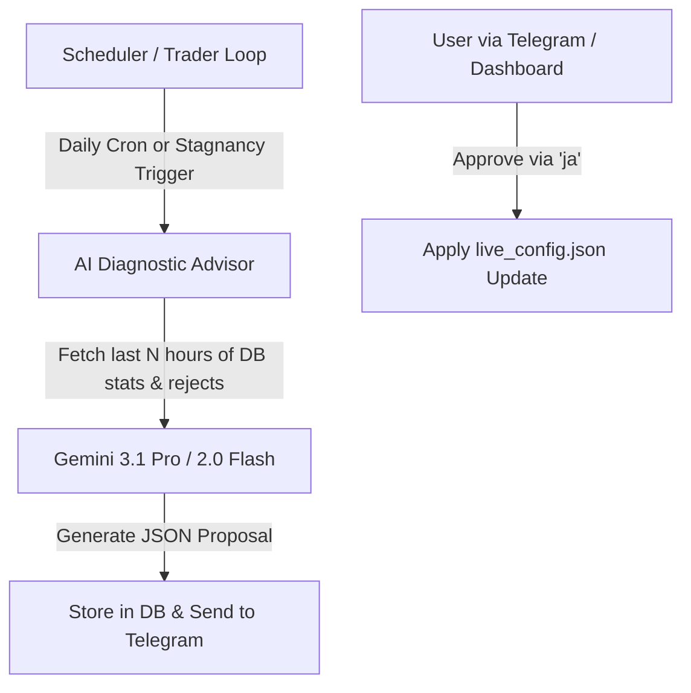

# Improvement Plan - Frequent AI Config Tuning & Diagnostic Advisor

**Date**: 2026-05-25  
**Status**: DRAFT (Pending User Review)  
**Target File Path**: `plans/improvement_plan_2026-05-25_frequent_ai_config_tuning.md`

---

## Executive Summary

The current system relies on a weekly report agent ([generate_weekly_ai_report.py](file:///mnt/data/bongus_trading_bot/scripts/generate_weekly_ai_report.py)) to review trading stats and propose parameter updates. However, weekly adjustments are too slow to respond to rapid crypto market regime shifts (e.g. sudden spikes in volatility or funding rate dispersion). 

This plan details how to increase the frequency of AI parameter suggestions (daily/hourly or event-driven) and integrate a smart performance-based trigger that automatically queries Gemini when trading has stalled or is unprofitable.

---

## Goals

1. **Increase Evaluation Frequency**: Support periodic daily or sub-daily runs of the AI advisor.
2. **Implement Performance-Based / Stagnancy Triggers**: Automatically execute the AI advisor if the bot is locked out of trading (e.g., all symbols blocked) or if PnL is stagnant for a threshold duration.
3. **Refactor & Parameterize Reporting**: Refactor `generate_weekly_ai_report.py` into a flexible script that supports custom lookback windows (e.g., 24 hours vs. 7 days).
4. **Safe Inline Application**: Preserve the human-in-the-loop validation via the existing Telegram `ja`/`nein` command interface.

---

## Proposed Architecture

### 1. Refactor Report Generation
Refactor [generate_weekly_ai_report.py](file:///mnt/data/bongus_trading_bot/scripts/generate_weekly_ai_report.py) to a generalized `generate_ai_report.py` accepting the following CLI flags:
- `--days N`: Lookback period in days (e.g., `1` for daily review, `7` for weekly).
- `--trigger [cron|stagnant|manual]`: Metadata tagging the trigger source.

### 2. Implementation of Automated Triggers
We will implement two trigger pathways:
1. **Periodic Trigger (Daily)**: 
   - Integrate a daily check into the supervisor service or run a cron script every 24 hours (e.g., at `00:05 UTC` daily maintenance).
2. **Underperformance / Stagnancy Trigger**:
   - Inside [live_trader_v2.py](file:///mnt/data/bongus_trading_bot/scripts/live_trader_v2.py) or the watchdog's maintenance check, evaluate:
     - **Stagnant Trades**: If no new trades have been entered for $> 24$ hours AND there are available slot vacancies.
     - **Rejection Rate**: If the ratio of `rejected_candidates / total_scanned` remains at 100% for consecutive cycles.
     - **PnL Drawdown**: If open PnL drops below a specific threshold (e.g., soft drawdown triggered).
   - If triggered, invoke the AI advisor script with a `--days 1 --trigger stagnant` parameter.

### 3. Enhancing Gemini Prompt for Rejection Diagnosis
Modify the Gemini system prompt to supply context about the **rejection reasons** (e.g. parsing `candidate_snapshots` or `risk_state` regime blocked symbols). This tells Gemini *exactly* why the bot is blocked so it can recommend targeted adjustments (e.g. raising `regime_filter_price_shock_pct` or lowering `entry_ann_funding_threshold`).

---

## File Changes & Impact Analysis

### [NEW] `scripts/generate_ai_report.py` (Replaces `generate_weekly_ai_report.py`)
- Accepts `--days` and `--trigger` parameters.
- Pulls recent `candidate_snapshots` to aggregate reasons why symbols are blocked.

### [MODIFY] [king_watchdog.py](file:///mnt/data/bongus_trading_bot/bongus/monitoring/king_watchdog.py) or [live_trader_v2.py](file:///mnt/data/bongus_trading_bot/scripts/live_trader_v2.py)
- Monitor trade and candidate stagnation.
- Spawn the advisor process asynchronously if stagnancy triggers fire.

### [MODIFY] [telegram_alerter.py](file:///mnt/data/bongus_trading_bot/bongus/monitoring/telegram_alerter.py)
- Allow Telegram bot to receive manual trigger commands (e.g., `/diagnose`).

---

## Verification Plan

### Automated Tests
- Mock Gemini API payloads and test parser robustness in `tests/test_ai_advisor.py`.
- Simulate a "stagnant" market regime in a unit test to verify that the underperformance trigger fires exactly once (with cooldowns to prevent spamming the API).

### Manual Verification
- Execute `./.venv/bin/python scripts/generate_ai_report.py --days 1 --trigger manual`.
- Verify receipt of the Telegram proposal, send `ja [proposal_id]`, and confirm the config changes are applied to `live_config.json`.
